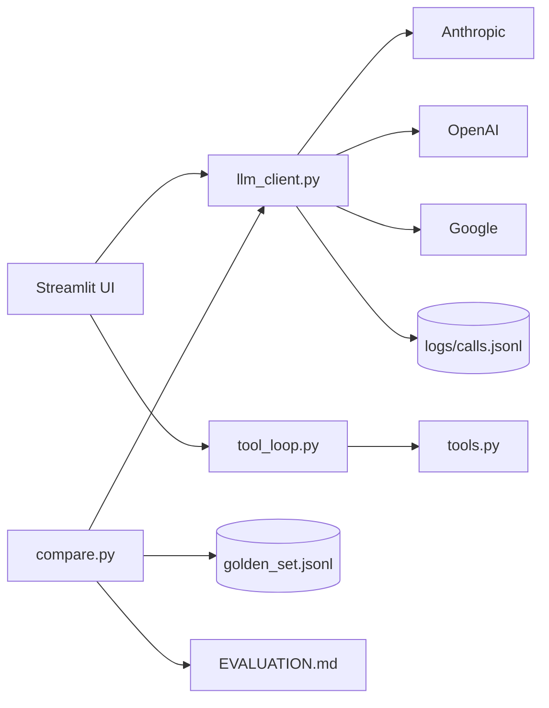

# Monat 1 – Modern LLM Engineering
**Woche 1–4 · Tag 1–16 · Projekt: `llm-playground`**

**Monatsziel:** Du beherrschst die Schicht direkt am Modell. Am Ende kannst du für jede Aufgabe begründet ein Modell auswählen, den Prompt systematisch entwickeln, strukturierte Ausgaben erzwingen, Tools anbinden – und du kennst die Kosten jedes einzelnen Calls.

**Warum das zuerst:** Du hast bereits mit Azure OpenAI, LLM-APIs und LangChain gearbeitet. Dieser Monat ist deshalb kein Grundlagenkurs, sondern eine **Systematisierung**: aus „funktioniert bei mir" wird „ich weiß warum, und ich kann es messen".

---

# WOCHE 1 – Modelle, Tokens, Context

**Wochenziel:** Du kannst die Modelllandschaft vom September 2026 einordnen und weißt, was ein Call kostet, bevor du ihn absendest.
**Themen:** Modellfamilien, Tokenisierung, Kontextfenster, Context Engineering, erste Multi-Provider-Calls
**Praxisergebnis:** Repo `llm-playground` steht, ein Tokenzähler mit Kostenrechner läuft, ein providerübergreifender Client funktioniert.

---

## Tag 1 · Montag – Die Modelllandschaft September 2026

**Zeit:** 60 Minuten

### 🎯 Lernziel
Du kannst die aktuellen Modellfamilien in Kategorien einordnen (Frontier / Workhorse / Fast / Open Weights) und benennen, welche Eigenschaft für welche Aufgabe entscheidend ist.

### 📚 1. Lernen – 20 Min
**Artificial Analysis – Model Comparison**
Link: https://artificialanalysis.ai
Dauer: 15 Min
Zu bearbeiten: Die Übersichtstabelle. Konzentriere dich auf vier Spalten: Intelligence Index, Output-Preis pro Mio. Token, Ausgabegeschwindigkeit, Kontextfenster. Ignoriere die Detailbenchmarks.

Danach 5 Min: **heise KI Update** (schon im Training gehört) → 1 Zeile in `radar.md`.

Warum relevant: Die Modellauswahl ist 2026 die folgenreichste Architekturentscheidung. Preisspannen zwischen 0,05 € und 50 € pro Mio. Token bedeuten Faktor 1000 bei den Betriebskosten – bei oft nur wenigen Prozent Qualitätsunterschied für deine konkrete Aufgabe.

### 💻 2. Praxis – 30 Min
Repo anlegen und die erste Wissensdatei bauen.

```bash
mkdir llm-playground && cd llm-playground && git init
python -m venv .venv && source .venv/bin/activate
pip install anthropic openai google-genai python-dotenv rich tiktoken
mkdir -p src eval notes
```

Erstelle `notes/models.md` mit einer Tabelle für **8 Modelle** (jeweils 2 pro Anbieter: Anthropic, OpenAI, Google, ein Open-Weights-Modell):

| Modell | Anbieter | Input $/1M | Output $/1M | Kontext | Stärke laut Benchmark | Wofür ICH es einsetzen würde |
|---|---|---|---|---|---|---|

Die letzte Spalte ist die wichtigste – sie zwingt dich zur Übersetzung von Benchmark in Anwendung.

Erwartetes Ergebnis: `notes/models.md` mit 8 ausgefüllten Zeilen, Commit `docs: modelllandschaft september 2026`.

### 🧠 3. Reflexion – 10 Min
**Kontrollfragen:**
1. Welches Modell würdest du für die Klassifikation von 100.000 Support-Tickets wählen – und warum nicht das beste?
2. Was bedeutet ein 1-Mio-Token-Kontextfenster in Seiten Text, und was kostet es einmal zu füllen?
3. Welche Eigenschaft eines Modells kann ein Benchmark grundsätzlich nicht messen?

**Dokumentieren:** Schreibe in `notes/models.md` ganz unten drei Sätze: „Wenn ich heute ein Projekt starten müsste, würde ich mit ___ anfangen, weil ___. Wechseln würde ich zu ___, wenn ___."

---

## Tag 2 · Mittwoch – Tokens, Tokenizer und die Kostenrechnung

**Zeit:** 60 Minuten

### 🎯 Lernziel
Du kannst erklären, warum deutscher Text mehr Tokens kostet als englischer, und du kannst die Kosten eines Calls vor dem Absenden berechnen.

### 📚 1. Lernen – 15 Min
**Hugging Face LLM Course – Kapitel „Tokenizers"**
Link: https://huggingface.co/learn/llm-course
Dauer: 15 Min
Zu bearbeiten: Nur den Abschnitt über Subword-Tokenisierung (BPE). Die Trainings-Kapitel überspringen.

Warum relevant: Tokenisierung ist die Einheit, in der du ab jetzt denkst – für Kosten, für Kontextbudgets, für Chunk-Größen in Monat 2. Du kennst BPE aus dem Studium; hier geht es um die praktische Konsequenz.

Danach 10 Min: **heise KI Update → Understand.** Eine Technologie aus deinem Radar auswählen, Primärquelle öffnen, 3 Sätze notieren.

### 💻 2. Praxis – 25 Min
Erstelle `src/tokens.py`:

```python
# Anforderungen:
# 1. Funktion count_tokens(text, model) -> int
# 2. Funktion estimate_cost(input_tokens, output_tokens, model) -> float
#    (Preise aus notes/models.md in ein dict PRICING übernehmen)
# 3. Vergleichsfunktion: gleicher Inhalt auf Deutsch und Englisch
```

Testtext: Nimm einen Absatz aus einer echten deutschen Fachdokumentation (z. B. aus deinem Job, anonymisiert) und dessen englische Übersetzung.

Libraries: `tiktoken` für OpenAI-Modelle, für Anthropic die `count_tokens`-Methode des SDK, für HF-Modelle `transformers.AutoTokenizer`.

Erwartetes Ergebnis: Eine Ausgabe wie `DE: 312 Tokens | EN: 241 Tokens | Aufschlag: +29,5%` und ein Kostenwert in Euro.

### 🧠 3. Reflexion – 10 Min
**Kontrollfragen:**
1. Wie hoch war dein deutscher Token-Aufschlag – und was bedeutet das für ein System mit 50.000 deutschen Anfragen pro Monat?
2. Warum kosten Output-Tokens fast immer mehr als Input-Tokens?
3. Welche zwei Textarten produzieren besonders viele Tokens pro Zeichen?

**Dokumentieren:** `notes/tag02-tokens.md` – die gemessenen Zahlen und eine Hochrechnung auf 1 Mio. Anfragen.

---

## Tag 3 · Donnerstag – Kontextfenster und Context Engineering

**Zeit:** 60 Minuten

### 🎯 Lernziel
Du kannst ein Kontextbudget aufstellen und benennen, warum „mehr Kontext" ab einem Punkt die Qualität senkt statt hebt.

### 📚 1. Lernen – 20 Min
**Anthropic Engineering – Context Engineering**
Link: https://www.anthropic.com/engineering
Dauer: 20 Min
Zu bearbeiten: Den Artikel zu effektivem Context Engineering. Falls du ihn nicht findest, ist der Artikel „Building effective agents" auf derselben Seite ein gleichwertiger Einstieg – den brauchst du in Monat 3 ohnehin.

Warum relevant: Context Engineering hat Prompt Engineering als wichtigste Fähigkeit abgelöst. Die Frage ist nicht mehr „wie formuliere ich?", sondern „was gehört überhaupt in dieses Fenster – und in welcher Reihenfolge?".

### 💻 2. Praxis – 30 Min
Erstelle `src/context_budget.py`: ein Werkzeug, das ein Kontextbudget aufstellt.

```
Eingabe: Modell, Systemprompt, Anzahl erwarteter Retrieval-Chunks,
         durchschnittliche Chunk-Größe, Konversationshistorie
Ausgabe: Tabelle mit Anteil pro Komponente, Restbudget, Kosten pro Call
```

Rechne drei Szenarien durch und speichere die Ergebnisse:
- Chatbot ohne Retrieval
- RAG-Assistent mit 8 Chunks à 500 Tokens
- Agent mit 12 Tool-Definitionen und 20 Schritten Historie

Erwartetes Ergebnis: Du siehst schwarz auf weiß, dass beim Agenten-Szenario die Tool-Definitionen und die Historie das Budget dominieren – nicht die eigentliche Nutzerfrage.

### 🧠 3. Reflexion – 10 Min
**Kontrollfragen:**
1. Was ist der „Lost in the Middle"-Effekt und was folgt daraus für die Reihenfolge deiner Kontextbestandteile?
2. Dein Agent hat nach 20 Schritten 80 % des Fensters mit Historie gefüllt. Nenne zwei Strategien.
3. Wann ist ein 1-Mio-Token-Fenster die schlechtere Lösung als RAG?

**Dokumentieren:** `notes/tag03-context.md` – deine drei Budget-Szenarien als Tabelle.

---

## Tag 4 · Samstag – Multi-Provider-Client (Build-Session)

**Zeit:** 90 Minuten

### 🎯 Lernziel
Du hast einen eigenen, schlanken Client, der drei Anbieter über eine einheitliche Schnittstelle anspricht und dabei Tokens, Kosten und Latenz protokolliert.

### 📚 1. Lernen – 25 Min
**Offizielle Quickstarts, je 8 Min:**
- Anthropic: https://docs.claude.com
- OpenAI: https://platform.openai.com/docs
- Google: https://ai.google.dev

Zu bearbeiten: jeweils nur „Quickstart" und die Parameterliste der Chat-/Responses-Methode.

Warum relevant: Die Unterschiede zwischen den SDKs sind klein, aber die Unterschiede in Parametern (Reasoning-Steuerung, System-Prompt-Handhabung, Tool-Format) sind genau das, was dich später beim Wechsel aufhält.

### 💻 2. Praxis – 55 Min
Erstelle `src/llm_client.py`:

```python
from dataclasses import dataclass

@dataclass
class LLMResponse:
    text: str
    model: str
    input_tokens: int
    output_tokens: int
    cost_eur: float
    latency_ms: int

def complete(prompt: str, model: str, system: str = "", **kwargs) -> LLMResponse:
    """Routet anhand des Modellnamens zum passenden Provider-SDK."""
```

Anforderungen:
- Mindestens 3 Anbieter
- Keine Framework-Abhängigkeit (bewusst kein LangChain – du sollst die rohe Schicht sehen)
- Jeder Call wird als JSON-Zeile in `logs/calls.jsonl` angehängt
- `.env.example` mit den drei Key-Namen, `.env` in `.gitignore`

Test: Dieselbe Frage an alle drei Anbieter, Ausgabe als `rich`-Tabelle mit Kosten und Latenz.

Erwartetes Ergebnis: Ein Aufruf, drei Antworten, eine Vergleichstabelle. Commit + Push.

### 🧠 3. Reflexion – 10 Min
**Kontrollfragen:**
1. Welcher Anbieter war am schnellsten, welcher am günstigsten – und waren die Antworten qualitativ unterschiedlich genug, dass es zählt?
2. Welche Parameter gibt es bei einem Anbieter, die bei den anderen fehlen?
3. Warum baust du hier bewusst ohne Framework?

**Wochenreflexion** (falls du sie Freitag nicht gemacht hast): `reviews/woche-01.md`.

---

# WOCHE 2 – APIs, Prompting, Structured Outputs

**Wochenziel:** Du entwickelst Prompts systematisch statt intuitiv und erzwingst verlässlich strukturierte Ausgaben.
**Themen:** API-Parameter, Reasoning-Modelle, Prompt-Struktur, JSON Schema / Structured Outputs
**Praxisergebnis:** Ein Prompt-Versionierungssystem und ein Extraktionsmodul mit Pydantic-Validierung.

---

## Tag 5 · Montag – API-Parameter und was sie wirklich tun

**Zeit:** 60 Minuten

### 🎯 Lernziel
Du kannst begründen, wann du `temperature` senkst, was `top_p` tatsächlich bewirkt und warum du beides selten gleichzeitig anfassen solltest.

### 📚 1. Lernen – 15 Min
**OpenAI Platform Docs – API Reference, Abschnitt Parameter**
Link: https://platform.openai.com/docs
Dauer: 15 Min
Zu bearbeiten: `temperature`, `top_p`, `max_output_tokens`, `stop`, `seed`, `n`.

Danach: heise KI Update → Discover, 1 Zeile in `radar.md`.

### 💻 2. Praxis – 35 Min
Erstelle `src/param_lab.py`: Dieselbe Aufgabe, 5× pro Konfiguration.

Aufgabe: „Erzeuge einen Produktnamen für eine Software zur Vertragsanalyse."
Konfigurationen: `temperature` 0.0 / 0.7 / 1.2 und `top_p` 0.1 / 0.9.

Miss: Wie viele der 5 Antworten sind identisch? Wie lang sind sie im Schnitt?

Zweiter Durchlauf mit einer **deterministischen** Aufgabe: „Extrahiere das Rechnungsdatum aus diesem Text." Gleiche Konfigurationen.

Erwartetes Ergebnis: Du siehst, dass Temperatur bei kreativen Aufgaben Varianz erzeugt und bei extrahierenden Aufgaben vor allem Fehler.

### 🧠 3. Reflexion – 10 Min
**Kontrollfragen:**
1. Was ist der Unterschied zwischen `temperature` und `top_p` auf der Ebene der Wahrscheinlichkeitsverteilung?
2. Warum liefert `seed` auch bei identischen Parametern nicht immer identische Ergebnisse?
3. Welche Temperatur wählst du für ein System, das JSON für eine Datenbank produziert – und warum ist die Antwort nicht „egal, das Schema fängt es ab"?

**Dokumentieren:** `notes/tag05-params.md` mit deinen Messwerten.

---

## Tag 6 · Mittwoch – Reasoning-Modelle: wann sie sich lohnen

**Zeit:** 60 Minuten

### 🎯 Lernziel
Du kannst entscheiden, wann sich der Aufpreis für erweitertes Reasoning rechnet – mit einer eigenen Zahl als Beleg.

### 📚 1. Lernen – 15 Min
**Anthropic Docs – Extended Thinking** und **OpenAI Docs – Reasoning**
Links: https://docs.claude.com und https://platform.openai.com/docs
Dauer: je 7 Min
Zu bearbeiten: Wie wird der Reasoning-Aufwand gesteuert, und wie werden Reasoning-Tokens abgerechnet?

Warum relevant: Reasoning-Tokens sind Output-Tokens. Ein Reasoning-Call kann das Fünf- bis Zwanzigfache eines normalen Calls kosten. Die Frage „braucht diese Aufgabe das?" ist eine echte Architekturentscheidung.

Danach 10 Min: heise KI Update → Understand.

### 💻 2. Praxis – 25 Min
Erstelle `eval/reasoning_test.py`. Drei Aufgabentypen, je einmal mit und ohne erweitertes Reasoning:

1. **Extraktion:** Datum und Betrag aus einem Rechnungstext
2. **Mehrstufige Logik:** Eine Rabattstaffel mit drei Bedingungen auf einen konkreten Fall anwenden
3. **Planung:** „Welche Schritte brauche ich, um X zu prüfen?"

Miss für jeden: korrekt (ja/nein), Kosten, Latenz.

Erwartetes Ergebnis: Eine Tabelle, aus der hervorgeht, dass Reasoning bei Aufgabe 1 nur Geld kostet und bei Aufgabe 2 möglicherweise den Unterschied macht.

### 🧠 3. Reflexion – 10 Min
**Kontrollfragen:**
1. Bei welcher deiner drei Aufgaben hat Reasoning messbar geholfen? Um welchen Faktor stiegen die Kosten?
2. Warum ist ein Reasoning-Modell für eine Klassifikationsaufgabe mit 100.000 Datensätzen fast immer die falsche Wahl?
3. Was ist der Unterschied zwischen Reasoning im Modell und einer Chain-of-Thought-Aufforderung im Prompt?

**Dokumentieren:** `notes/tag06-reasoning.md` mit der Entscheidungsregel, die du daraus ableitest.

---

## Tag 7 · Donnerstag – Prompts systematisch entwickeln

**Zeit:** 60 Minuten

### 🎯 Lernziel
Du entwickelst Prompts als versionierte Artefakte mit messbarem Vorher-Nachher, statt sie im Chat zu optimieren.

### 📚 1. Lernen – 20 Min
**Anthropic Docs – Prompt Engineering Overview**
Link: https://docs.claude.com/en/docs/build-with-claude/prompt-engineering/overview
Dauer: 20 Min
Zu bearbeiten: Die Übersicht plus die Abschnitte zu Beispielen (Multishot) und zu strukturierenden Tags.

Warum relevant: Du kennst Prompt Engineering praktisch. Was hier dazukommt, ist die Disziplin, jede Änderung gegen ein Testset zu prüfen statt gegen den Eindruck.

### 💻 2. Praxis – 30 Min
Lege `prompts/` an. Aufgabe: Aus einer E-Mail eines Lieferanten die Kernpunkte extrahieren.

Schreibe **drei Versionen** in separate Dateien:
- `prompts/extract_v1.md` – naiv, eine Zeile Anweisung
- `prompts/extract_v2.md` – mit Rolle, Struktur, Begrenzungen, klarem Ausgabeformat
- `prompts/extract_v3.md` – v2 plus 2 Few-Shot-Beispiele

Teste alle drei gegen **5 Beispiel-E-Mails** (selbst geschrieben, realistisch). Bewerte manuell: vollständig / teilweise / falsch.

Erwartetes Ergebnis: Eine Tabelle in `notes/tag07-prompts.md` mit 15 Bewertungen und dem Befund, welche Änderung am meisten gebracht hat.

### 🧠 3. Reflexion – 10 Min
**Kontrollfragen:**
1. Welche einzelne Änderung von v1 zu v2 hatte den größten Effekt?
2. Warum haben Few-Shot-Beispiele bei manchen Aufgaben kaum Wirkung?
3. Was ist der Nachteil sehr langer Systemprompts, jenseits der Kosten?

**Dokumentieren:** Notiere deine persönliche Prompt-Checkliste mit 6 Punkten. Die benutzt du für den Rest der 6 Monate.

---

## Tag 8 · Samstag – Structured Outputs mit Schema-Garantie (Build-Session)

**Zeit:** 90 Minuten

### 🎯 Lernziel
Du erzwingst valides, typsicheres JSON und weißt, wie du mit den Fällen umgehst, in denen das Schema erfüllt, der Inhalt aber falsch ist.

### 📚 1. Lernen – 25 Min
**OpenAI Docs – Structured Outputs** und **Anthropic Docs – Tool Use für strukturierte Ausgaben**
Links: https://platform.openai.com/docs und https://docs.claude.com
Dauer: 25 Min
Zu bearbeiten: Wie ein JSON Schema übergeben wird, welche Schema-Features unterstützt werden, und was passiert, wenn das Modell das Schema nicht erfüllen kann.

### 💻 2. Praxis – 55 Min
Erstelle `src/extract.py`:

```python
from pydantic import BaseModel, Field
from datetime import date
from typing import Literal

class Lieferantenrisiko(BaseModel):
    lieferant: str
    vertragsbeginn: date | None
    vertragswert_eur: float | None
    risikostufe: Literal["niedrig", "mittel", "hoch"]
    begruendung: str = Field(max_length=300)
    zitate: list[str] = Field(description="Wörtliche Belegstellen aus dem Text")
```

Anforderungen:
1. Schema aus dem Pydantic-Modell generieren und an die API übergeben
2. Antwort mit Pydantic validieren, bei Fehler **einmal** mit dem Fehlertext nachfragen (Repair-Loop, max. 1 Versuch)
3. Gegen 8 selbst geschriebene Vertragsauszüge testen

Der Feldname `zitate` ist Absicht: Er zwingt das Modell zum Beleg und macht Halluzinationen sichtbar. Das nutzt du in Monat 2 wieder.

Erwartetes Ergebnis: 8/8 schema-valide Ausgaben. Prüfe dann manuell, bei wie vielen die `zitate` tatsächlich im Quelltext stehen – das ist deine erste echte Halluzinationsmessung.

### 🧠 3. Reflexion – 10 Min
**Kontrollfragen:**
1. Wie viele Ausgaben waren schema-valide, aber inhaltlich falsch? Was sagt das über Structured Outputs als Qualitätsmaßnahme?
2. Warum sind `Literal`-Typen für Kategorien besser als freier Text mit der Anweisung „wähle eines von drei"?
3. Wann ist ein Repair-Loop teurer als ein besserer Prompt?

**Commit + Push.** Wochenreflexion `reviews/woche-02.md`.

---

# WOCHE 3 – Tool Calling, Caching, Modellvergleich

**Wochenziel:** Du baust einen robusten Tool-Loop von Hand und kannst Modelle systematisch gegeneinander antreten lassen.
**Themen:** Function/Tool Calling, Fehlerbehandlung im Loop, Prompt Caching, Vergleichsharness
**Praxisergebnis:** Ein Tool-Loop mit Fehlerbehandlung und ein Modellvergleichs-Runner.

---

## Tag 9 · Montag – Tool Calling von Grund auf

**Zeit:** 60 Minuten

### 🎯 Lernziel
Du kannst den vollständigen Tool-Calling-Zyklus ohne Framework implementieren und verstehst, dass das Modell niemals ein Tool ausführt – es schlägt nur vor.

### 📚 1. Lernen – 15 Min
**Anthropic Docs – Tool Use**
Link: https://docs.claude.com
Dauer: 15 Min
Zu bearbeiten: Den Ablauf: Tool-Definitionen mitschicken → Modell antwortet mit `tool_use` → du führst aus → Ergebnis als `tool_result` zurück → Modell antwortet final.

Danach: heise KI Update → Discover.

### 💻 2. Praxis – 35 Min
Erstelle `src/tools.py` und `src/tool_loop.py`.

Zwei Tools:
```python
def berechne(ausdruck: str) -> str:
    """Wertet einen mathematischen Ausdruck aus. Nur +,-,*,/,(),Zahlen."""

def waehrungskurs(von: str, nach: str) -> str:
    """Gibt einen (fest hinterlegten) Wechselkurs zurück."""
```

Der Loop: Frage → Modell → falls `tool_use`, ausführen → Ergebnis zurück → wiederholen bis Textantwort.

Testfrage, die beide Tools braucht: „Ein Vertrag läuft über 3 Jahre mit 4.500 USD monatlich. Was ist der Gesamtwert in Euro?"

Erwartetes Ergebnis: Das Modell ruft beide Tools auf, in der richtigen Reihenfolge. Gib jeden Schritt mit `rich` sichtbar aus.

### 🧠 3. Reflexion – 10 Min
**Kontrollfragen:**
1. Wer führt den Code aus – das Modell oder dein Programm? Welche Sicherheitskonsequenz folgt daraus?
2. Was passiert, wenn deine Tool-Beschreibung mehrdeutig ist?
3. Warum ist der Docstring eines Tools faktisch ein Prompt?

**Dokumentieren:** `notes/tag09-tools.md` – protokolliere den vollständigen Nachrichtenverlauf eines Durchlaufs.

---

## Tag 10 · Mittwoch – Robuste Tool-Loops

**Zeit:** 60 Minuten

### 🎯 Lernziel
Dein Loop überlebt fehlerhafte Tools, Endlosschleifen und schlechte Argumente.

### 📚 1. Lernen – 15 Min
**Anthropic Engineering – Writing tools for agents**
Link: https://www.anthropic.com/engineering
Dauer: 15 Min
Zu bearbeiten: Den Abschnitt zu Fehlerrückgaben und Tool-Beschreibungen.

Warum relevant: Das ist die Vorbereitung für Monat 4. Ein Agent ist im Kern dieser Loop plus State – wer den Loop nicht beherrscht, debuggt später blind im Framework.

Danach 10 Min: heise KI Update → Understand.

### 💻 2. Praxis – 25 Min
Erweitere `src/tool_loop.py` um:

1. `max_iterations=8` mit klarer Abbruchmeldung
2. Fehler im Tool werden **nicht** geworfen, sondern als Text zurückgegeben: `"FEHLER: Division durch Null. Prüfe den Ausdruck."`
3. Ein Kostenzähler, der bei Überschreitung eines Budgets (z. B. 0,05 €) abbricht
4. Ein Tool, das absichtlich fehlschlägt, um das zu testen

Erwartetes Ergebnis: Bei einem fehlerhaften Tool-Aufruf korrigiert sich das Modell selbst und versucht es anders. Das protokollierst du.

### 🧠 3. Reflexion – 10 Min
**Kontrollfragen:**
1. Hat sich das Modell nach dem Fehlertext selbst korrigiert? Was sagt die Formulierung des Fehlertexts darüber aus?
2. Warum ist `max_iterations` keine Optimierung, sondern eine Sicherheitsmaßnahme? (Stichwort: OWASP Excessive Agency, Platz 3 in 2026)
3. Was passiert, wenn zwei Tools sich in der Beschreibung überlappen?

**Dokumentieren:** `notes/tag10-robustheit.md`.

---

## Tag 11 · Donnerstag – Prompt Caching und Kostenoptimierung

**Zeit:** 60 Minuten

### 🎯 Lernziel
Du kannst Caching einsetzen und die Ersparnis in Euro beziffern.

### 📚 1. Lernen – 15 Min
**Anthropic Docs – Prompt Caching** (und die entsprechenden OpenAI-Docs)
Link: https://docs.claude.com
Dauer: 15 Min
Zu bearbeiten: Was ist cachebar, wie lange hält der Cache, wie wird ein Cache-Treffer abgerechnet.

Warum relevant: Cache-Lesevorgänge sind drastisch günstiger als frische Input-Tokens – bei aktuellen Modellen ist der Unterschied erheblich. Bei einem RAG- oder Agentensystem mit langem Systemprompt ist das der größte einzelne Kostenhebel.

### 💻 2. Praxis – 35 Min
Erstelle `eval/cache_test.py`:

1. Baue einen Systemprompt von ca. 4.000 Tokens (z. B. eine fiktive interne Richtlinie)
2. Sende 10 verschiedene kurze Fragen dagegen – **ohne** Caching
3. Wiederhole **mit** Caching-Markierung
4. Vergleiche: Gesamtkosten, Latenz des ersten vs. der folgenden Calls

Erwartetes Ergebnis: Eine Tabelle mit der Ersparnis in Prozent und in Euro, hochgerechnet auf 10.000 Anfragen.

### 🧠 3. Reflexion – 10 Min
**Kontrollfragen:**
1. Wie hoch war deine Ersparnis? Ab welcher Systemprompt-Länge lohnt sich Caching?
2. Warum muss der cachebare Teil am **Anfang** des Prompts stehen?
3. Welche Architekturentscheidung (die du in Monat 2 treffen wirst) wird durch Caching günstiger, als sie ohne wäre?

**Dokumentieren:** `notes/tag11-caching.md`.

---

## Tag 12 · Samstag – Der Modellvergleichs-Runner (Build-Session)

**Zeit:** 90 Minuten

### 🎯 Lernziel
Du hast ein Werkzeug, das beliebige Aufgaben über beliebige Modelle laufen lässt und Qualität, Kosten und Latenz gegenüberstellt. Das ist dein wichtigstes Artefakt aus Monat 1.

### 📚 1. Lernen – 20 Min
**OpenAI Cookbook – Evaluation-Beispiele**
Link: https://cookbook.openai.com
Dauer: 20 Min
Zu bearbeiten: Ein Beispiel-Notebook zum Aufbau eines Vergleichslaufs. Du brauchst nur die Struktur, nicht den Code.

### 💻 2. Praxis – 60 Min
Erstelle `src/compare.py`:

```python
# Eingabe: tasks.jsonl mit {"id", "prompt", "expected", "type"}
#          models: Liste von Modellnamen
# Ausgabe: results.jsonl + Markdown-Tabelle
#          pro (Modell, Task): Antwort, Kosten, Latenz, Score
```

Scoring erstmal einfach: `exact_match` für Extraktionen, `contains_all` für Stichwortprüfungen, `manual` für offene Aufgaben (du bewertest nachträglich).

`eval/tasks.jsonl` mit **12 Aufgaben**: 4 Extraktion, 4 Klassifikation, 4 offene Generierung. Nimm realistische Beispiele aus deinem Arbeitsumfeld.

Laufen lassen über 4 Modelle (1 Frontier, 1 Workhorse, 1 schnelles/günstiges, 1 Open-Weights über einen Hoster oder lokal).

Erwartetes Ergebnis: Eine Tabelle in `EVALUATION.md`, aus der hervorgeht, dass das teuerste Modell bei mindestens einem Aufgabentyp nicht gewinnt.

### 🧠 3. Reflexion – 10 Min
**Kontrollfragen:**
1. Bei welchem Aufgabentyp war das günstige Modell gleich gut? Was sparst du, wenn du dort routest?
2. Wo sind deine Scoring-Funktionen zu grob? (Diese Schwäche behebst du in Monat 3 mit LLM-as-a-Judge.)
3. Welches Modell hatte die beste Kosten-Qualitäts-Relation für **deine** Aufgaben – und weicht das vom öffentlichen Leaderboard ab?

**Commit + Push.** Wochenreflexion `reviews/woche-03.md`.

---

# WOCHE 4 – Zusammenbauen, UI, Abschluss

**Wochenziel:** Projekt 1 ist ein vorzeigbares Repo mit Oberfläche, Dokumentation und Zahlen.
**Themen:** Golden Set, einfache Scorer, Streamlit-UI, README & Architekturdiagramm
**Praxisergebnis:** `llm-playground` ist öffentlich, dokumentiert und bestanden.

---

## Tag 13 · Montag – Dein erstes Golden Set

**Zeit:** 60 Minuten

### 🎯 Lernziel
Du verstehst, warum ein kleines, sorgfältig gebautes Testset mehr wert ist als ein großes, das automatisch generiert wurde.

### 📚 1. Lernen – 15 Min
**Hugging Face LLM Course – Kapitel zu Evaluation** oder **Ragas Docs, Einstiegsseite**
Links: https://huggingface.co/learn/llm-course · https://docs.ragas.io
Dauer: 15 Min
Zu bearbeiten: Nur die Begriffsklärung: Testset, Ground Truth, Metrik. Die Tiefe kommt in Monat 3.

Danach: heise KI Update → Discover.

### 💻 2. Praxis – 35 Min
Erstelle `eval/golden_set.jsonl` mit **15 Fällen** aus deinem echten Arbeitskontext (anonymisiert):

```json
{"id": "g01", "prompt": "...", "expected": "...", "type": "extraction",
 "difficulty": "easy", "note": "Datum steht im Fließtext, nicht im Kopf"}
```

Regeln für ein gutes Golden Set:
- 5 leichte, 7 mittlere, 3 bewusst schwere Fälle
- Mindestens 2 Fälle, bei denen die richtige Antwort „steht nicht im Text" ist
- Jeder Fall hat eine Notiz, **warum** er drin ist

Der letzte Punkt ist der Unterschied zwischen einem Testset und einer Sammlung von Beispielen.

### 🧠 3. Reflexion – 10 Min
**Kontrollfragen:**
1. Warum sind die „steht nicht im Text"-Fälle so wichtig?
2. Was wäre ein Fall, der dein Set systematisch verzerrt?
3. Wie oft solltest du ein Golden Set erweitern – und was ist der Auslöser?

**Dokumentieren:** `EVALUATION.md` anlegen, Testset-Beschreibung hinein.

---

## Tag 14 · Mittwoch – Scorer und automatisierter Lauf

**Zeit:** 60 Minuten

### 🎯 Lernziel
Dein Vergleichslauf bewertet automatisch und gibt eine reproduzierbare Zahl aus.

### 📚 1. Lernen – 10 Min
**DeepEval – Getting Started**
Link: https://deepeval.com
Dauer: 10 Min
Zu bearbeiten: Nur die Idee der pytest-Integration. Du baust heute noch selbst, aber du sollst wissen, was es fertig gibt.

Danach 10 Min: heise KI Update → Understand.

### 💻 2. Praxis – 30 Min
Erstelle `eval/scorers.py` mit vier Funktionen:

```python
def exact_match(output, expected) -> float
def contains_all(output, expected_keywords) -> float
def json_valid(output, schema) -> float
def refusal_correct(output, should_refuse) -> float   # für "steht nicht im Text"
```

Binde sie in `src/compare.py` ein. Lauf über das Golden Set mit 3 Modellen.

Erwartetes Ergebnis: Eine Gesamtzahl pro Modell, z. B. `Modell A: 12/15 · 0,004 € · 1.240 ms Ø`.

### 🧠 3. Reflexion – 10 Min
**Kontrollfragen:**
1. Welcher deiner Scorer ist am anfälligsten für falsche Negative?
2. Wie viele Modelle haben bei den „steht nicht im Text"-Fällen halluziniert?
3. Warum ist `exact_match` bei generativen Aufgaben fast wertlos?

**Dokumentieren:** Ergebnisse in `EVALUATION.md`.

---

## Tag 15 · Donnerstag – Streamlit-Oberfläche

**Zeit:** 60 Minuten

### 🎯 Lernziel
Dein Playground ist bedienbar – auch für jemanden, der deinen Code nicht liest.

### 📚 1. Lernen – 10 Min
**Streamlit Docs – Get started**
Link: https://docs.streamlit.io
Dauer: 10 Min
Zu bearbeiten: `st.selectbox`, `st.text_area`, `st.columns`, `st.metric`.

### 💻 2. Praxis – 40 Min
Erstelle `app.py`:

- Dropdown: Modellauswahl (Mehrfachauswahl für Vergleich)
- Textfeld: Systemprompt (vorbefüllt aus `prompts/`)
- Textfeld: Nutzerprompt
- Schalter: Tools aktivieren, Structured Output aktivieren
- Ausgabe: Spalten nebeneinander pro Modell
- Unter jeder Ausgabe: `st.metric` für Tokens, Kosten in Cent, Latenz

```bash
pip install streamlit
streamlit run app.py
```

Erwartetes Ergebnis: Ein funktionierender Playground. Mach einen Screenshot für das README.

### 🧠 3. Reflexion – 10 Min
**Kontrollfragen:**
1. Was wäre für einen fachlichen Nutzer die verwirrendste Stelle deiner Oberfläche?
2. Welche Kennzahl fehlt noch, die du in Monat 3 nachrüsten wirst?
3. Warum ist eine Oberfläche für ein Portfolio-Repo unverhältnismäßig wertvoll?

---

## Tag 16 · Samstag – Dokumentation und Monatstest 1

**Zeit:** 90 Minuten

### 💻 Teil 1 – Repo fertigstellen (45 Min)

1. `ARCHITECTURE.md` mit Mermaid-Diagramm:



2. `README.md` nach der Struktur aus der Übersichtsdatei – inkl. Screenshot, Tabelle „Technische Entscheidungen", **Limitations**
3. `DECISIONS.md` mit mindestens 4 Einträgen (z. B.: „Kein LangChain in Projekt 1 – Begründung: …")
4. Repo auf GitHub öffentlich, als Pinned Repo setzen

### 🧠 Teil 2 – Monatstest 1 (45 Min)

**Leitfrage: Wann setzt du welches LLM ein – und was kostet das?**

Beantworte schriftlich in `notes/test-monat-1.md`, ohne nachzuschlagen:

1. Nenne vier Kriterien für die Modellauswahl und ordne sie nach Wichtigkeit für ein internes Dokumenten-Q&A-System.
2. Ein Kollege sagt: „Wir nehmen einfach immer das beste Modell." Nenne drei konkrete Gegenargumente – mindestens eines mit einer Zahl aus deinem Projekt.
3. Erkläre in drei Sätzen, was beim Tool Calling technisch passiert – ohne die Wörter „Magie" oder „das Modell macht dann".
4. Wann sind Structured Outputs **keine** ausreichende Qualitätssicherung?
5. Ein Prompt funktioniert im Chat gut, im Produktivsystem schlecht. Nenne drei mögliche Ursachen.
6. Wie hoch ist der Token-Aufschlag für Deutsch gegenüber Englisch bei deinem Testtext, und was folgt daraus?
7. Wann lohnt sich ein Reasoning-Modell? Nenne deine Regel plus die Zahl, auf der sie beruht.
8. Was ist der größte Kostenhebel in einem System mit langem Systemprompt?

**Praktische Aufgabe (20 Min):**
Neue Anforderung: „Wir wollen 200.000 eingehende Lieferanten-E-Mails pro Monat nach Dringlichkeit klassifizieren, dreistufig." Schreibe eine halbe Seite: gewähltes Modell, Begründung, geschätzte Monatskosten (gerechnet, nicht geraten), Prompt-Skizze, wie du die Qualität prüfst.

**Bewertungskriterien:**

| Kriterium | Bestanden, wenn … |
|---|---|
| Modellauswahl | Du nennst mindestens ein Kriterium, das nicht auf Leaderboards steht |
| Kostenrechnung | Deine Schätzung basiert auf gemessenen Tokenzahlen, nicht auf Gefühl |
| Tool Calling | Du beschreibst den Rückgabezyklus korrekt und nennst die Sicherheitsimplikation |
| Ehrlichkeit | Du nennst mindestens zwei Dinge, die du noch nicht sicher kannst |

**Bevor du zu Monat 2 weitergehst, solltest du können:**
- Einen API-Call ohne Framework absetzen und seine Kosten vorher berechnen
- Einen Tool-Loop von Hand schreiben
- Ein JSON-Schema erzwingen und validieren
- Drei Modelle auf demselben Testset vergleichen und das Ergebnis in einer Tabelle begründen

Wenn zwei davon wackeln: Nimm dir eine Zusatzwoche. Das ist kein Rückstand, das ist der Plan.

**Wochenreflexion** `reviews/woche-04.md` + **Monatsrückblick**: Was war die wichtigste Erkenntnis? Was hättest du früher wissen wollen?
