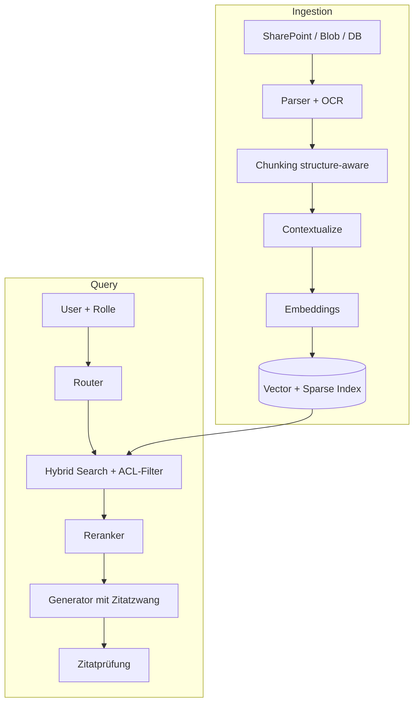

# Monat 2 – RAG richtig bauen
**Woche 5–8 · Tag 17–32 · Projekt: `ai-knowledge-assistant`**

**Monatsziel:** Du baust ein Retrieval-System nach dem Stand von 2026 – Hybrid Search mit Reranking statt naiver Vektorsuche – und du kannst jede einzelne Verbesserung mit einer Zahl belegen.

**Die zentrale Haltung dieses Monats:** Du baust zuerst absichtlich die **schlechte** Version (naives RAG) und misst sie. Dann verbesserst du sie schrittweise und misst nach jedem Schritt. Am Monatsende hast du keine Meinung über RAG, sondern eine Messreihe. Das ist der Unterschied zwischen jemandem, der RAG kann, und jemandem, der ein RAG-Tutorial gemacht hat.

**Testdokumente:** Such dir **eine** Sammlung von 30–60 Seiten, die du gut kennst – interne Richtlinien (anonymisiert), eine technische Dokumentation, ein Gesetzestext, die DSGVO. Wichtig: Du musst beurteilen können, ob eine Antwort richtig ist. Nimm nicht das Standard-PDF aus einem Tutorial.

---

# WOCHE 5 – Embeddings, Chunking, Baseline

**Wochenziel:** Eine naive RAG-Pipeline läuft und du kennst ihre Schwächen aus eigener Messung.
**Themen:** Embeddings, Distanzmaße, Chunking-Strategien, Vector Store, Baseline
**Praxisergebnis:** `rag_baseline.py` + 20 Testfragen + erste Fehleranalyse.

---

## Tag 17 · Montag – Embeddings jenseits der Theorie

**Zeit:** 60 Minuten

### 🎯 Lernziel
Du kannst erklären, warum ein Bi-Encoder-Embedding verlustbehaftet ist, und du hast selbst gesehen, wo es scheitert.

### 📚 1. Lernen – 15 Min
**MTEB Leaderboard**
Link: https://huggingface.co/spaces/mteb/leaderboard
Dauer: 10 Min
Zu bearbeiten: Filtere auf deutschsprachige oder mehrsprachige Retrieval-Aufgaben. Notiere drei Kandidaten mit Dimension und Modellgröße.

Warum relevant: Du kennst Embeddings aus dem Studium. Was hier zählt, ist die Auswahl für **dein** Sprach- und Domänenprofil – ein englisch-optimiertes Modell auf deutschen Verträgen ist ein häufiger, unsichtbarer Qualitätsverlust.

Danach: heise KI Update → Discover.

### 💻 2. Praxis – 35 Min
Repo anlegen, dann `src/embed_lab.py`:

```bash
mkdir ai-knowledge-assistant && cd ai-knowledge-assistant && git init
python -m venv .venv && source .venv/bin/activate
pip install sentence-transformers numpy rich pypdf python-dotenv
```

Aufgabe: Schreibe **10 Satzpaare** aus deiner Domäne:
- 3 Paare, die dasselbe bedeuten, aber keine Wörter teilen („Kündigungsfrist drei Monate" / „Der Vertrag endet mit einem Quartal Vorlauf")
- 3 Paare, die viele Wörter teilen, aber Gegenteiliges bedeuten („Die Haftung ist ausgeschlossen" / „Die Haftung ist nicht ausgeschlossen")
- 4 neutrale Paare

Berechne Kosinus-Ähnlichkeit mit **drei** Embedding-Modellen (eins klein/lokal, eins mehrsprachig, eins über API).

Erwartetes Ergebnis: Du siehst, dass die Verneinungspaare bei allen Modellen hohe Ähnlichkeit haben. Das ist **die** fundamentale Schwäche dichter Retrieval-Verfahren – und die Begründung für alles, was du in Woche 6 baust.

### 🧠 3. Reflexion – 10 Min
**Kontrollfragen:**
1. Welche Ähnlichkeit hatte dein bestes Verneinungspaar? Was bedeutet das für ein Compliance-System?
2. Warum ist Kosinus-Ähnlichkeit bei normalisierten Vektoren äquivalent zum Skalarprodukt – und warum ist das praktisch relevant?
3. Ein Modell hat 1536 Dimensionen, ein anderes 384. Was kostet die höhere Dimension konkret?

**Dokumentieren:** `notes/tag17-embeddings.md` mit deiner Ähnlichkeitstabelle.

---

## Tag 18 · Mittwoch – Chunking-Strategien im Vergleich

**Zeit:** 60 Minuten

### 🎯 Lernziel
Du kennst vier Chunking-Strategien und weißt, dass die Wahl folgenreicher ist als die Wahl des Embedding-Modells.

### 📚 1. Lernen – 15 Min
**NirDiamant / RAG_Techniques (GitHub)**
Link: https://github.com/NirDiamant/RAG_Techniques
Dauer: 15 Min
Zu bearbeiten: Nur die README-Übersicht plus die Notebooks zu Chunking überfliegen. Nicht ausführen – du schreibst selbst.

Warum relevant: Das Repo ist eine der besten kostenlosen Sammlungen aktueller RAG-Techniken und begleitet dich diesen ganzen Monat als Nachschlagewerk.

Danach 10 Min: heise KI Update → Understand.

### 💻 2. Praxis – 25 Min
Erstelle `src/chunking.py` mit vier Strategien auf demselben Dokument:

1. **Fixed:** 500 Tokens, kein Overlap
2. **Fixed + Overlap:** 500 Tokens, 80 Overlap
3. **Recursive:** an Absatz → Satz → Wort, Ziel 500
4. **Structure-aware:** an Überschriften (Markdown-/PDF-Struktur), Überschrift als Präfix in jedem Chunk

Gib für jede Strategie aus: Anzahl Chunks, Median-Länge, kürzester/längster Chunk – und **drucke drei zufällige Chunks pro Strategie aus und lies sie**.

Erwartetes Ergebnis: Bei Strategie 1 findest du Chunks, die mitten im Satz beginnen und deren Bedeutung ohne den vorherigen Chunk verloren ist. Genau die verursachen später falsche Antworten.

### 🧠 3. Reflexion – 10 Min
**Kontrollfragen:**
1. Welche Strategie produzierte die meisten „verwaisten" Chunks ohne eigenständigen Sinn?
2. Warum hilft es, die Überschrift in jeden Chunk zu kopieren – obwohl es Tokens kostet?
3. Ein Vertrag hat Tabellen. Welche Strategie scheitert daran am spektakulärsten?

**Dokumentieren:** `notes/tag18-chunking.md` – Statistiktabelle plus je ein abschreckendes Beispiel.

---

## Tag 19 · Donnerstag – Vector Store aufsetzen

**Zeit:** 60 Minuten

### 🎯 Lernziel
Du hast einen lokalen Vektorindex, verstehst HNSW im Grundsatz und kannst Metadaten filtern.

### 📚 1. Lernen – 15 Min
**Qdrant Documentation – Quickstart & Filtering**
Link: https://qdrant.tech/documentation/
Dauer: 15 Min
Zu bearbeiten: Quickstart, Collections, Payload/Filtering. HNSW-Abschnitt überfliegen.

Warum relevant: Qdrant läuft lokal in Docker, ist kostenlos, kann Hybrid Search nativ und hat ordentliche Metadatenfilter – alles, was du diesen Monat brauchst. (Chroma geht auch; Qdrant hat für Woche 6 die bessere Sparse-Unterstützung.)

### 💻 2. Praxis – 35 Min
```bash
docker run -p 6333:6333 -v $(pwd)/qdrant_storage:/qdrant/storage qdrant/qdrant
pip install qdrant-client
```

Erstelle `src/index.py`:
- Dokumente laden, mit der besten Strategie aus Tag 18 chunken
- Embeddings erzeugen (Batch-Verarbeitung!)
- In Qdrant speichern mit Payload: `{quelle, seite, ueberschrift, chunk_id, text}`
- Funktion `search(query, k=5, filter=None)`

Teste: 5 Suchanfragen, gib jeweils die Top-5 mit Score und Quelle aus.

Erwartetes Ergebnis: Der Index steht, Suche liefert plausible Treffer. Notiere zwei Anfragen, bei denen die Treffer **nicht** überzeugen.

### 🧠 3. Reflexion – 10 Min
**Kontrollfragen:**
1. Was macht HNSW schnell – und was ist der Preis dafür?
2. Warum speicherst du den Text mit in der Payload, obwohl er schon als Vektor da ist?
3. Welcher Metadatenfilter wäre in einem Unternehmenskontext sicherheitsrelevant? (Stichwort: Zugriffsrechte)

**Dokumentieren:** `notes/tag19-vectorstore.md`.

---

## Tag 20 · Samstag – Naive RAG-Baseline + Testset (Build-Session)

**Zeit:** 90 Minuten

### 🎯 Lernziel
Du hast eine vollständige, bewusst einfache RAG-Pipeline und eine gemessene Baseline, gegen die alles Weitere antritt.

### 📚 1. Lernen – 20 Min
**Microsoft Learn – „Develop generative AI apps on Microsoft Foundry", Modul zu RAG/Grounding**
Link: https://learn.microsoft.com/en-us/training/paths/develop-generative-ai-apps/
Dauer: 20 Min
Zu bearbeiten: Das Modul zu Optimierungsstrategien (Prompting vs. RAG vs. Fine-Tuning). Nur lesen, keine Azure-Ressourcen anlegen.

Warum relevant: Die Entscheidung „RAG oder etwas anderes" ist die erste Architekturfrage. Und du bekommst das Enterprise-Vokabular für deinen Azure-Kontext gleich mit.

### 💻 2. Praxis – 60 Min
**Teil A (25 Min):** `src/rag_baseline.py` – die klassische naive Pipeline:
```
Frage → embed → top-5 Chunks → in Prompt einfügen → Antwort
```
Kein Reranking, kein Hybrid, keine Query-Transformation. Absichtlich.

**Teil B (35 Min):** `eval/testset.jsonl` mit **20 Fragen** zu deinen Dokumenten:

```json
{"id": "q01", "frage": "...", "referenz_antwort": "...",
 "relevante_chunks": ["chunk_id_1", "chunk_id_7"],
 "typ": "faktisch|mehrteilig|verneinend|nicht_beantwortbar"}
```

Verteilung: 8 faktisch, 5 mehrteilig (Antwort braucht 2+ Stellen), 4 verneinend/knifflig, 3 **nicht beantwortbar** (die Antwort steht nicht in den Dokumenten).

Für `relevante_chunks` musst du selbst nachsehen, welche Chunks die Antwort enthalten. Das ist mühsam – und es ist die wertvollste Stunde dieses Monats, weil du danach Retrieval-Qualität objektiv messen kannst.

Lauf die Baseline über alle 20 Fragen, speichere die Antworten.

Erwartetes Ergebnis: Ein `results/baseline.jsonl`. Lies alle 20 Antworten und markiere manuell: richtig / teilweise / falsch / halluziniert.

### 🧠 3. Reflexion – 10 Min
**Kontrollfragen:**
1. Wie viele der 3 „nicht beantwortbar"-Fragen hat das System trotzdem beantwortet? (Das ist deine Halluzinationsrate.)
2. Bei welchem Fragetyp versagte die Baseline am deutlichsten?
3. War das Problem eher Retrieval (falsche Chunks gefunden) oder Generierung (richtige Chunks, falsche Antwort)?

Frage 3 ist die wichtigste Diagnosefrage im ganzen RAG-Bereich. Notiere die Aufteilung.

**Commit + Push.** Wochenreflexion `reviews/woche-05.md`.

---

# WOCHE 6 – Der 2026-Standard: Hybrid + Reranking

**Wochenziel:** Deine Retrieval-Qualität steigt messbar durch Hybrid Search und Reranking.
**Themen:** BM25, Reciprocal Rank Fusion, Cross-Encoder-Reranking, Retrieval-Metriken
**Praxisergebnis:** `hybrid.py` und `retrieval_eval.py` mit Vorher-Nachher-Zahlen.

---

## Tag 21 · Montag – Warum dichte Suche allein nicht reicht

**Zeit:** 60 Minuten

### 🎯 Lernziel
Du kannst erklären, welche Anfragen BM25 löst und Vektorsuche nicht – und umgekehrt.

### 📚 1. Lernen – 15 Min
**Anthropic Engineering – Contextual Retrieval**
Link: https://www.anthropic.com/engineering
Dauer: 15 Min
Zu bearbeiten: Den Abschnitt zur Kombination von BM25 und Embeddings sowie die dort berichteten Fehlerreduktionen.

Warum relevant: Das ist die meistzitierte praktische Grundlage für den heutigen Hybrid-Standard. Der Artikel ist von 2024, bleibt aber die klarste Darstellung des Prinzips – die Zahlen sind belastbar und der Ansatz ist 2026 Standard geworden.

Danach: heise KI Update → Discover.

### 💻 2. Praxis – 35 Min
```bash
pip install rank-bm25
```

Erstelle `src/sparse.py`: BM25-Index über dieselben Chunks.

Wichtig für Deutsch: Tokenisierung mit Lowercasing und Entfernen von Satzzeichen; optional einfaches Stemming.

Teste **beide** Suchen (dense und BM25) auf 10 Anfragen, davon bewusst:
- 3 mit exakten Begriffen (Aktenzeichen, Paragraf, Produktname, Zahl)
- 3 mit Umschreibungen ohne wörtliche Übereinstimmung
- 4 gemischt

Erwartetes Ergebnis: Eine Tabelle, in der BM25 bei den exakten Begriffen gewinnt und die Vektorsuche bei den Umschreibungen. Genau deshalb kombiniert man beides.

### 🧠 3. Reflexion – 10 Min
**Kontrollfragen:**
1. Nenne eine Anfrage aus deinem Test, bei der die Vektorsuche den richtigen Chunk gar nicht in den Top-10 hatte.
2. Warum ist BM25 bei Eigennamen und IDs so stark?
3. Was passiert mit BM25 bei einem Tippfehler in der Anfrage – und mit der Vektorsuche?

**Dokumentieren:** `notes/tag21-bm25.md`.

---

## Tag 22 · Mittwoch – Reciprocal Rank Fusion selbst implementieren

**Zeit:** 60 Minuten

### 🎯 Lernziel
Du implementierst RRF von Hand (es sind etwa 20 Zeilen) und verstehst, warum man Ränge statt Scores fusioniert.

### 📚 1. Lernen – 10 Min
Kurzrecherche zu Reciprocal Rank Fusion – die Formel:

```
RRF_score(d) = Σ über alle Ranglisten r:  1 / (k + rank_r(d))     mit k ≈ 60
```

Verstehe die Kernidee: Scores verschiedener Systeme sind nicht vergleichbar (Kosinus-Werte und BM25-Werte leben auf verschiedenen Skalen), **Ränge** sind es. Das `k` dämpft den Einfluss der Spitzenplätze.

Danach 15 Min: heise KI Update → Understand.

### 💻 2. Praxis – 25 Min
Erstelle `src/hybrid.py`:

```python
def rrf(ranked_lists: list[list[str]], k: int = 60) -> list[tuple[str, float]]:
    """Fusioniert mehrere Ranglisten von chunk_ids zu einer."""
```

Dann `hybrid_search(query, k=20)`, das dense und BM25 je Top-20 holt und fusioniert.

Experimentiere mit `k` = 10, 60, 200 auf deinen 10 Anfragen und beobachte, wie sich die Rangliste ändert.

Erwartetes Ergebnis: Eine funktionierende Fusion – und ein Gefühl dafür, dass `k=60` nicht magisch ist, sondern ein Standardwert, den man prüfen sollte.

### 🧠 3. Reflexion – 10 Min
**Kontrollfragen:**
1. Warum darf man Kosinus-Score und BM25-Score nicht einfach addieren?
2. Was passiert bei sehr kleinem `k`? Bei sehr großem?
3. Wie würdest du eine dritte Rangliste (z. B. aus Metadaten-Relevanz) einbauen?

**Dokumentieren:** `notes/tag22-rrf.md`.

---

## Tag 23 · Donnerstag – Cross-Encoder-Reranking

**Zeit:** 60 Minuten

### 🎯 Lernziel
Du verstehst den Unterschied zwischen Bi-Encoder und Cross-Encoder und setzt einen Reranker ein.

### 📚 1. Lernen – 15 Min
**Hugging Face – BGE Reranker v2-m3 Model Card**
Link: https://huggingface.co/BAAI/bge-reranker-v2-m3
Dauer: 15 Min
Zu bearbeiten: Model Card plus Nutzungsbeispiel. Das Modell ist mehrsprachig (funktioniert auf Deutsch), läuft lokal auf CPU und ist kostenlos.

Warum relevant: Reranking ist laut praktisch allen aktuellen Berichten der größte einzelne Qualitätssprung nach Hybrid Search. Der Cross-Encoder sieht Anfrage und Dokument **gemeinsam** – deshalb ist er genauer und deshalb ist er langsam. Genau deshalb kommt er erst nach der Vorauswahl.

### 💻 2. Praxis – 35 Min
```bash
pip install FlagEmbedding
# oder: sentence-transformers CrossEncoder
```

Erstelle `src/rerank.py`:
- Eingabe: Anfrage + Top-20 aus `hybrid_search`
- Ausgabe: Top-5 nach Cross-Encoder-Score
- Miss die zusätzliche Latenz

Vergleiche für deine 20 Testfragen: Wie oft ist der wirklich relevante Chunk (aus `relevante_chunks`) nach Reranking in den Top-3, verglichen mit vorher?

Erwartetes Ergebnis: Ein spürbarer Sprung – und eine Latenzzahl (typischerweise 50–150 ms), die du als Preis dafür nennen kannst.

### 🧠 3. Reflexion – 10 Min
**Kontrollfragen:**
1. Warum kann man einen Cross-Encoder nicht direkt auf alle 5.000 Chunks anwenden?
2. Wie viele Kandidaten solltest du vom Retriever holen, damit Reranking sich lohnt – und wo ist die Grenze?
3. In welchem Fall verschlechtert ein Reranker das Ergebnis?

**Dokumentieren:** `notes/tag23-reranking.md` mit Vorher-Nachher und Latenz.

---

## Tag 24 · Samstag – Retrieval-Metriken (Build-Session)

**Zeit:** 90 Minuten

### 🎯 Lernziel
Du misst Retrieval-Qualität objektiv mit Recall@k, MRR und nDCG und hast eine Fortschrittstabelle.

### 📚 1. Lernen – 20 Min
Recherchiere und verstehe drei Metriken. Formeln:

- **Recall@k** = (Anzahl relevanter Chunks in Top-k) / (Anzahl aller relevanten Chunks)
- **MRR** = Mittelwert von 1/Rang des ersten relevanten Treffers
- **nDCG@k** = DCG@k / idealer DCG@k, wobei DCG = Σ rel_i / log₂(i+1)

Warum relevant: Das sind Information-Retrieval-Metriken, die du aus dem Studium wahrscheinlich kennst. Der Punkt ist, sie auf **dein** System anzuwenden – die meisten RAG-Projekte messen nur die Endantwort und wissen deshalb nie, ob das Problem im Retrieval oder in der Generierung sitzt.

### 💻 2. Praxis – 60 Min
Erstelle `eval/retrieval_eval.py`:

```python
def recall_at_k(retrieved: list[str], relevant: list[str], k: int) -> float
def mrr(retrieved: list[str], relevant: list[str]) -> float
def ndcg_at_k(retrieved: list[str], relevant: list[str], k: int) -> float
```

Lauf alle **vier** Konfigurationen über dein 20-Fragen-Testset:

| Konfiguration | Recall@5 | MRR | nDCG@5 | Latenz Ø |
|---|---|---|---|---|
| A · Dense only (Baseline) | | | | |
| B · BM25 only | | | | |
| C · Hybrid (RRF) | | | | |
| D · Hybrid + Rerank | | | | |

Erwartetes Ergebnis: Eine vollständig ausgefüllte Tabelle in `EVALUATION.md`. **Das ist die Tabelle, die du in Bewerbungsgesprächen zeigst.**

### 🧠 3. Reflexion – 10 Min
**Kontrollfragen:**
1. Wie groß war der Sprung von A zu D – in Prozentpunkten Recall@5 und in Millisekunden?
2. Bei welchem Fragetyp half Hybrid am meisten, bei welchem Reranking?
3. Gibt es eine Frage, bei der D schlechter ist als A? Warum?

**Commit + Push.** Wochenreflexion `reviews/woche-06.md`.

---

# WOCHE 7 – Query-Transformation, Kontext, Zitate

**Wochenziel:** Du verbesserst die Anfrage, bevor sie den Index erreicht, und erzwingst belegte Antworten.
**Themen:** Query Rewriting, Multi-Query, Contextual Retrieval, Grounding mit Zitaten, Adaptive Routing
**Praxisergebnis:** Antworten mit Quellenangaben und ein Router, der unnötiges Retrieval einspart.

---

## Tag 25 · Montag – Query Rewriting und Multi-Query

**Zeit:** 60 Minuten

### 🎯 Lernziel
Du verbesserst Recall durch Umformulierung der Anfrage – und kennst den Preis in Latenz und Kosten.

### 📚 1. Lernen – 15 Min
**NirDiamant / RAG_Techniques – Query Transformations**
Link: https://github.com/NirDiamant/RAG_Techniques
Dauer: 15 Min
Zu bearbeiten: Die Abschnitte zu Query Rewriting, Step-Back Prompting und HyDE.

Danach: heise KI Update → Discover.

### 💻 2. Praxis – 35 Min
Erstelle `src/query_transform.py` mit drei Varianten:

1. **Rewrite:** Ein kleines, günstiges Modell formuliert die Nutzerfrage suchfreundlich um
2. **Multi-Query:** Drei Varianten der Frage erzeugen, alle suchen, per RRF fusionieren
3. **HyDE:** Das Modell schreibt eine *hypothetische* Antwort, diese wird eingebettet und zur Suche verwendet

Miss für alle drei auf deinem Testset: Recall@5, Zusatzkosten, Zusatzlatenz.

Erwartetes Ergebnis: Multi-Query verbessert Recall spürbar, kostet aber drei Suchläufe plus einen LLM-Call. Du kannst jetzt sagen, ob sich das für **deinen** Anwendungsfall rechnet.

### 🧠 3. Reflexion – 10 Min
**Kontrollfragen:**
1. Welche Variante brachte den besten Recall pro zusätzlichem Cent?
2. Wann schadet Query Rewriting? (Tipp: Was passiert mit einer präzisen Anfrage nach einer Vertragsnummer?)
3. Warum funktioniert HyDE überhaupt, obwohl die hypothetische Antwort möglicherweise falsch ist?

**Dokumentieren:** `notes/tag25-query.md`.

---

## Tag 26 · Mittwoch – Contextual Retrieval und Metadatenfilter

**Zeit:** 60 Minuten

### 🎯 Lernziel
Du reicherst Chunks mit Kontext an und filterst über Metadaten – zwei Maßnahmen mit sehr unterschiedlichem Aufwand-Nutzen-Profil.

### 📚 1. Lernen – 10 Min
**Anthropic Engineering – Contextual Retrieval** (zweiter Besuch, jetzt der Umsetzungsteil)
Link: https://www.anthropic.com/engineering
Dauer: 10 Min
Zu bearbeiten: Wie ein LLM jedem Chunk einen kurzen Kontextsatz voranstellt, und wie Prompt Caching das bezahlbar macht (dein Wissen aus Tag 11).

Danach 15 Min: heise KI Update → Understand.

### 💻 2. Praxis – 25 Min
Erstelle `src/contextualize.py`:

Für jeden Chunk: Sende Gesamtdokument (gecacht!) + Chunk an ein günstiges Modell mit der Anweisung, in 1–2 Sätzen zu erklären, worum es in diesem Chunk im Kontext des Gesamtdokuments geht. Dieser Kontext wird dem Chunk **vorangestellt**, bevor er eingebettet wird.

Wegen der Kosten: Mach das für **100 Chunks**, nicht für alle. Das reicht für die Messung.

Baue parallel Metadatenfilter ein: `search(query, filter={"abschnitt": "Haftung"})`.

Erwartetes Ergebnis: Recall-Vergleich auf den Fragen, die diese 100 Chunks betreffen – plus die Kostenrechnung für „alle Chunks kontextualisieren".

### 🧠 3. Reflexion – 10 Min
**Kontrollfragen:**
1. Was hat Contextual Retrieval bei deinen Fragen gebracht – und was hätte es für den gesamten Korpus gekostet?
2. Warum ist ein Metadatenfilter oft die billigere Lösung für dasselbe Problem?
3. Welcher Metadatenfilter ist in deinem Capstone-Szenario zwingend? (Denk an Zugriffsrechte.)

**Dokumentieren:** `notes/tag26-context.md`.

---

## Tag 27 · Donnerstag – Grounding und Zitate erzwingen

**Zeit:** 60 Minuten

### 🎯 Lernziel
Deine Antworten enthalten überprüfbare Quellenangaben, und du kannst die Halluzinationsrate beziffern.

### 📚 1. Lernen – 15 Min
**Microsoft Learn – Modul „Build knowledge-enhanced AI agents with Foundry IQ"**
Link: https://learn.microsoft.com/en-us/training/modules/introduction-foundry-iq/
Dauer: 15 Min
Zu bearbeiten: Die Abschnitte zu Grounding und zur Konfiguration konsistenter, zitierter Antworten. Nur lesen – keine Azure-Ressourcen nötig.

Warum relevant: Zeigt dir das Enterprise-Muster für zitierte Antworten. Für dein Azure-Profil direkt anschlussfähig.

### 💻 2. Praxis – 35 Min
Überarbeite deinen Antwort-Prompt in `src/generate.py`:

```
Beantworte ausschließlich anhand der bereitgestellten Auszüge.
Kennzeichne jede Aussage mit [Q1], [Q2] ... entsprechend dem Auszug.
Wenn die Auszüge die Frage nicht beantworten, antworte exakt:
"Die Frage lässt sich mit den vorliegenden Dokumenten nicht beantworten."
Erfinde keine Quellenangaben.
```

Kombiniere das mit Structured Output (dein Wissen aus Tag 8):

```python
class Antwort(BaseModel):
    antwort: str
    belege: list[Beleg]          # chunk_id + wörtliches Zitat
    beantwortbar: bool
```

Dann baue `src/verify.py`: Prüft **programmatisch**, ob jedes wörtliche Zitat tatsächlich im referenzierten Chunk vorkommt.

Erwartetes Ergebnis: Eine harte Zahl – „bei X von 20 Antworten stimmte mindestens ein Zitat nicht mit dem Quelltext überein". Das ist eine echte, automatisierbare Halluzinationsmessung.

### 🧠 3. Reflexion – 10 Min
**Kontrollfragen:**
1. Wie viele deiner 3 „nicht beantwortbar"-Fragen wurden jetzt korrekt abgelehnt – gegenüber der Baseline aus Tag 20?
2. Warum ist die programmatische Zitatprüfung stärker als jede Prompt-Anweisung?
3. Welche Art von Halluzination fängt diese Prüfung **nicht**?

**Dokumentieren:** `EVALUATION.md` um die Halluzinationsrate ergänzen.

---

## Tag 28 · Samstag – Adaptive RAG: nicht jede Frage braucht Retrieval (Build-Session)

**Zeit:** 90 Minuten

### 🎯 Lernziel
Du baust einen Router, der Anfragen nach Schwierigkeit sortiert und Kosten spart, ohne Qualität zu verlieren.

### 📚 1. Lernen – 20 Min
Recherchiere „Adaptive RAG". Kernidee: Ein Klassifikator vor der Pipeline sortiert jede Anfrage:
- **Einfach/Smalltalk/Allgemeinwissen** → gar kein Retrieval
- **Faktisch** → einfache Hybrid-Suche, kein Reranking
- **Komplex/mehrteilig** → volle Pipeline mit Multi-Query und Reranking

In der Praxis fallen erfahrungsgemäß 60–70 % der Produktionsanfragen in die ersten beiden Kategorien – dort spart der Router den Großteil der Kosten.

### 💻 2. Praxis – 60 Min
Erstelle `src/router.py`:

```python
class Routing(BaseModel):
    kategorie: Literal["kein_retrieval", "einfach", "komplex"]
    begruendung: str
```

Verwende ein **kleines, günstiges** Modell für die Klassifikation (das ist der Punkt – ein teures Modell als Router hebt die Ersparnis auf).

Erweitere dein Testset um 10 Fragen: 4 Smalltalk/Allgemeinwissen, 6 gemischt. Insgesamt 30 Fragen.

Miss über alle 30 Fragen:
- **Ohne Router:** Gesamtkosten, Ø-Latenz, Qualität
- **Mit Router:** Gesamtkosten, Ø-Latenz, Qualität, Fehlklassifikationsrate

Erwartetes Ergebnis: Deutliche Kostenreduktion bei gleicher oder fast gleicher Qualität – plus die Erkenntnis, dass Fehlklassifikationen in Richtung „zu wenig Retrieval" gefährlicher sind als umgekehrt.

### 🧠 3. Reflexion – 10 Min
**Kontrollfragen:**
1. Wie viel Prozent Kosten hast du gespart? Wie viele Fragen wurden falsch geroutet?
2. Warum ist eine Fehlklassifikation „komplex → einfach" schlimmer als „einfach → komplex"?
3. Wie würdest du den Router absichern? (Antwort in eine Richtung: Konfidenz-Schwelle, im Zweifel eskalieren.)

**Commit + Push.** Wochenreflexion `reviews/woche-07.md`.

---

# WOCHE 8 – GraphRAG, Long-Context, Enterprise-Einordnung

**Wochenziel:** Du kannst begründen, wann RAG **nicht** die Antwort ist, und kennst die Alternativen.
**Themen:** GraphRAG, Long-Context vs. RAG, Enterprise-RAG-Architektur, Monatstest
**Praxisergebnis:** Architekturdokument und ein fertiges, dokumentiertes Repo.

---

## Tag 29 · Montag – GraphRAG: Konzept verstehen, nicht produktiv bauen

**Zeit:** 60 Minuten

### 🎯 Lernziel
Du erkennst die Fragetypen, bei denen normales RAG strukturell versagt und ein Graph hilft.

### 📚 1. Lernen – 20 Min
**Microsoft GraphRAG (GitHub)**
Link: https://github.com/microsoft/graphrag
Dauer: 20 Min
Zu bearbeiten: README plus die Erklärung von „global search" vs. „local search". **Nicht installieren** – die Indexierung ist teuer und für dein Lernziel unnötig.

Warum relevant: Der klassische Fall ist die Frage „Was sind die übergreifenden Themen in diesen 500 Dokumenten?" – die kann kein Top-k-Retrieval beantworten, weil die Antwort in keinem einzelnen Chunk steht. Das zu erkennen ist die eigentliche Kompetenz.

**Priorisierungshinweis: GraphRAG produktiv aufzusetzen ist „Nice to know – aktuell nicht priorisieren".** Konzept und Erkennungsmerkmale reichen völlig.

Danach: heise KI Update → Discover.

### 💻 2. Praxis – 30 Min
Mini-Experiment mit `networkx` statt vollem GraphRAG:

1. Extrahiere aus 20 Chunks per LLM Entitäten und Beziehungen: `(Entität A, Beziehung, Entität B)`
2. Baue daraus einen Graphen
3. Stelle zwei Fragen, die der Graph beantwortet und dein RAG nicht: „Welche Akteure hängen mit X zusammen?" / „Welche Themen tauchen dokumentübergreifend auf?"

Erwartetes Ergebnis: Ein kleiner Graph plus die Erkenntnis, wie teuer die Extraktion für den Gesamtkorpus wäre.

### 🧠 3. Reflexion – 10 Min
**Kontrollfragen:**
1. Formuliere zwei Fragen aus deinem Capstone-Szenario, die einen Graphen bräuchten.
2. Was kostet GraphRAG bei 10.000 Dokumenten ungefähr – und was ist die pragmatische Alternative?
3. Warum ist GraphRAG kein Ersatz, sondern eine Ergänzung?

**Dokumentieren:** `notes/tag29-graphrag.md` – vor allem die Entscheidungsregel „wann Graph".

---

## Tag 30 · Mittwoch – Long-Context vs. RAG: die Kostenrechnung

**Zeit:** 60 Minuten

### 🎯 Lernziel
Du kannst mit Zahlen begründen, wann das Einfach-alles-in-den-Kontext-Werfen die bessere Lösung ist.

### 📚 1. Lernen – 10 Min
Schau in deine `notes/models.md` von Tag 1: Welche Modelle haben 1 Mio. Tokens Kontext, was kostet eine Mio. Input-Tokens?

Danach 15 Min: heise KI Update → Understand.

### 💻 2. Praxis – 25 Min
Erstelle `eval/longcontext_vs_rag.py`.

Nimm 10 Fragen aus deinem Testset und beantworte sie auf zwei Wegen:
- **A:** Vollständige Dokumentsammlung im Kontext (falls sie passt; sonst der größte sinnvolle Ausschnitt)
- **B:** Deine RAG-Pipeline

Miss: Korrektheit, Kosten pro Frage, Latenz. Rechne hoch: Was kosten 1.000 Anfragen pro Tag auf beiden Wegen – einmal mit und einmal ohne Prompt Caching?

Erwartetes Ergebnis: Eine Rechnung, die zeigt, dass Long-Context bei wenigen Anfragen auf kleinem Korpus gewinnt und bei Skalierung dramatisch verliert – außer, Caching verschiebt die Grenze.

### 🧠 3. Reflexion – 10 Min
**Kontrollfragen:**
1. Bei welcher Anfragenzahl pro Tag kippt die Rechnung in deinem Szenario?
2. Welchen Qualitätsvorteil hat Long-Context, den RAG strukturell nicht hat?
3. Welchen Vorteil hat RAG, der nichts mit Kosten zu tun hat? (Stichworte: Zitierbarkeit, Zugriffsrechte, Aktualisierbarkeit)

**Dokumentieren:** `notes/tag30-longcontext.md` mit deiner Break-even-Rechnung.

---

## Tag 31 · Donnerstag – Enterprise-RAG-Architektur skizzieren

**Zeit:** 60 Minuten

### 🎯 Lernziel
Du kannst eine RAG-Architektur für ein Unternehmen entwerfen, inklusive der Themen, die in Tutorials fehlen: Zugriffsrechte, Aktualisierung, Mehrsprachigkeit.

### 📚 1. Lernen – 20 Min
**Microsoft Learn – Lernpfad „Develop AI agents on Azure", Modul zu Foundry IQ / Wissensanbindung**
Link: https://learn.microsoft.com/en-us/training/paths/develop-ai-agents-azure/
Dauer: 20 Min
Zu bearbeiten: Das Modul zur Anbindung von Unternehmenswissen. Achte besonders auf: Datenquellen-Konfiguration, Aktualisierung, Zitationsverhalten.

### 💻 2. Praxis – 30 Min
Erstelle `ARCHITECTURE.md` für ein gedachtes Unternehmenssystem – nicht für dein Übungsprojekt, sondern für den Ernstfall:



Beantworte im Fließtext **fünf Fragen**, die Tutorials auslassen:
1. Wie kommen Zugriffsrechte in den Index, und wie verhindert der Filter, dass jemand Inhalte über Zitate erschließt?
2. Was passiert, wenn ein Dokument geändert wird? (Re-Indexierung: vollständig oder inkrementell?)
3. Was passiert bei gelöschten Dokumenten?
4. Wie gehst du mit deutsch/englisch gemischten Korpora um?
5. Wie erkennst du, dass die Qualität im Betrieb nachlässt?

Frage 5 ist die Brücke zu Monat 3.

### 🧠 3. Reflexion – 10 Min
**Kontrollfragen:**
1. Welche der fünf Fragen konntest du am wenigsten gut beantworten?
2. Warum ist ACL-Filterung nach dem Retrieval gefährlicher als davor?
3. Was ist der häufigste Grund, warum ein RAG-Pilot funktioniert und das Produktivsystem nicht?

---

## Tag 32 · Samstag – Repo fertigstellen und Monatstest 2

**Zeit:** 90 Minuten

### 💻 Teil 1 – Dokumentation (40 Min)

1. `README.md` nach Standardstruktur, mit Screenshot einer Antwort inkl. Zitaten
2. `EVALUATION.md` mit der vollständigen Fortschrittstabelle:

| Version | Recall@5 | MRR | Halluzinationsrate | Kosten/Frage | Latenz |
|---|---|---|---|---|---|
| v1 Naive (Tag 20) | | | | | |
| v2 Hybrid + RRF | | | | | |
| v3 + Reranking | | | | | |
| v4 + Zitatzwang | | | | | |
| v5 + Router | | | | | |

3. `DECISIONS.md`: mindestens 6 Einträge
4. **`LIMITATIONS`-Abschnitt im README** – schreib hier ehrlich auf, was dein System nicht kann. Das ist der wertvollste Abschnitt.

### 🧠 Teil 2 – Monatstest 2 (50 Min)

**Leitfrage: Warum funktioniert dein RAG-System schlecht und wie verbesserst du es?**

Schriftlich in `notes/test-monat-2.md`:

1. Ein RAG-System gibt falsche Antworten. Nenne die **Diagnosereihenfolge** – welche Frage klärst du zuerst, welche danach?
2. Nenne fünf Ursachen für schlechtes Retrieval und je eine Gegenmaßnahme.
3. Erkläre Hybrid Search und RRF so, dass es ein fachlicher Projektleiter versteht.
4. Warum ist ein Cross-Encoder genauer als ein Bi-Encoder, und warum nutzt man ihn trotzdem nicht für die erste Suche?
5. Ein Nutzer fragt nach einer Vertragsnummer und bekommt Unsinn, obwohl das Dokument im Index ist. Was ist wahrscheinlich das Problem?
6. Wann ist RAG die falsche Architektur? Nenne drei Fälle.
7. Wie misst du Halluzinationen automatisiert?
8. Was bedeutet Chunk-Größe für Recall und was für Precision?
9. Dein Recall@5 ist hoch, die Antworten sind trotzdem schlecht. Wo liegt das Problem?
10. Nenne die Zahl, die du am meisten verbessert hast – Ausgangswert, Endwert, Maßnahme.

**Praktische Aufgabe (25 Min):**
Sabotiere dein eigenes System: Setze `chunk_size=2000` ohne Overlap und schalte Reranking ab. Lauf die Evaluation. Dokumentiere in drei Sätzen, welche Metrik am stärksten fiel und warum – und stelle es wieder her.

**Bewertungskriterien:**

| Kriterium | Bestanden, wenn … |
|---|---|
| Diagnosefähigkeit | Du trennst sauber zwischen Retrieval-Fehlern und Generierungsfehlern |
| Messkultur | Jede Aussage über Verbesserung ist mit einer Zahl aus deinem Repo belegt |
| Angemessenheit | Du kannst drei Fälle nennen, in denen du RAG **nicht** einsetzen würdest |
| Erklärbarkeit | Frage 3 kommt ohne Fachjargon aus |

**Bevor du zu Monat 3 weitergehst, solltest du können:**
- Eine Hybrid-Retrieval-Pipeline mit Reranking von Grund auf bauen
- Recall@k, MRR und nDCG berechnen und interpretieren
- Zitate erzwingen und programmatisch verifizieren
- Begründen, wann Long-Context oder Graph die bessere Wahl wäre

**Wochenreflexion** `reviews/woche-08.md` + **Monatsrückblick**.
