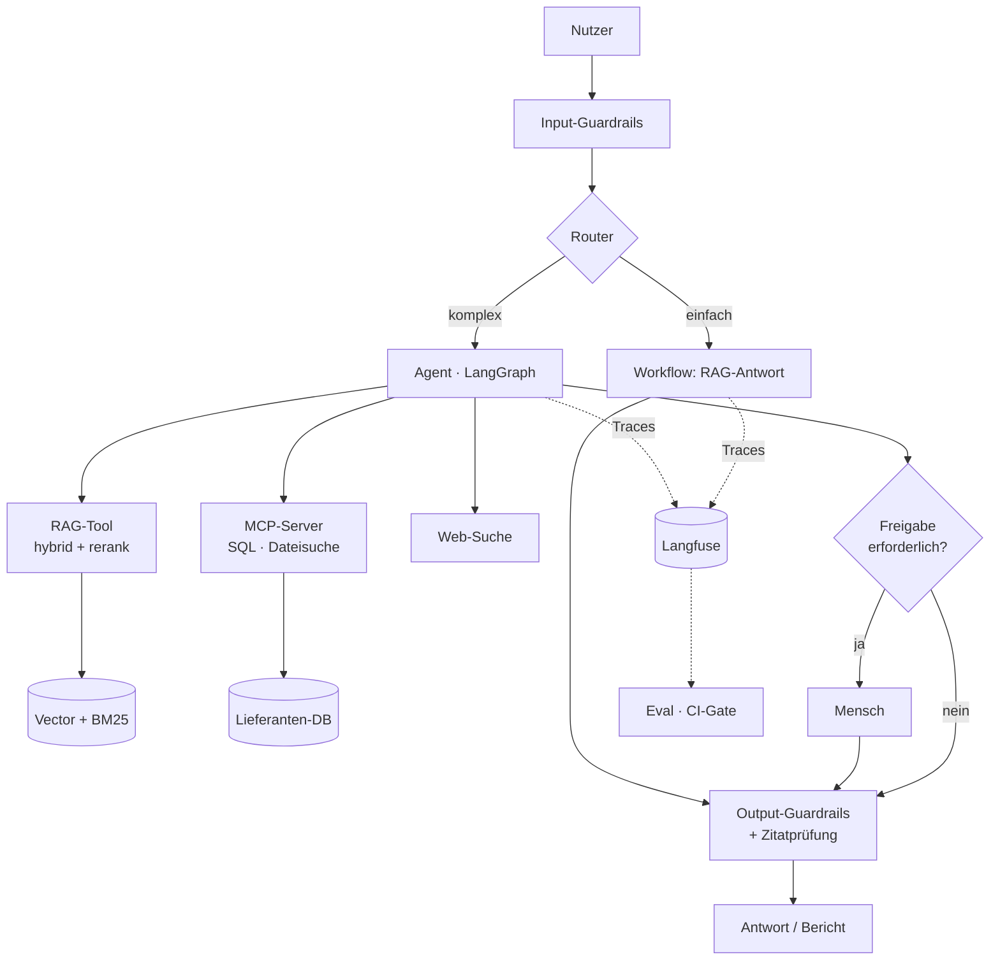

# Monat 6 – Production AI und Capstone
**Woche 21–24 · Tag 81–96 · Projekt: `vendor-risk-copilot`**

**Monatsziel:** Du baust ein vollständiges Enterprise-AI-System, das alle Bausteine der letzten fünf Monate kombiniert – und du kannst es einer fachfremden Person und einer technischen Person gleichermaßen erklären.

**Die Haltung dieses Monats:** Du baust nichts Neues. Du **integrierst**, was du schon kannst, und bringst es auf Produktionsniveau. Der Unterschied zwischen einem Portfolio aus vier Einzelprojekten und einem, das zusätzlich ein integriertes System enthält, ist der Unterschied zwischen „kann Bausteine" und „kann Systeme".

---

# WOCHE 21 – Entwurf und Fundament

**Wochenziel:** Die Architektur steht, ist begründet und hat ein Budget.
**Themen:** Scoping, Architekturentwurf, Kosten-/Latenzbudget, Repo-Fundament
**Praxisergebnis:** PRD, Architekturdiagramm, Budgetrechnung, lauffähiges Grundgerüst.

---

## Tag 81 · Montag – Scoping: was das System tun soll und was nicht

**Zeit:** 60 Minuten

### 🎯 Lernziel
Du definierst Umfang und Erfolgskriterien, bevor du eine Zeile Code schreibst.

### 📚 1. Lernen – 10 Min
Kein neues Material. Lies stattdessen deine `notes/agent-entscheidung.md` (Tag 41) noch einmal und wende sie auf das Capstone-Szenario an.

Danach: heise KI Update → Discover.

### 💻 2. Praxis – 40 Min
Erstelle `PRD.md` (eine Seite, nicht mehr):

```markdown
# Vendor & Compliance Risk Copilot

## Nutzer
Wer benutzt das? Welche Vorkenntnisse? Wie oft?

## Die drei Aufgaben, die es lösen muss
1. Frage zu bestehenden Verträgen/Richtlinien beantworten – mit Quellen
2. Neuen Lieferanten gegen interne Policies prüfen
3. Strukturierten Risikobericht erstellen – mit menschlicher Freigabe

## Explizit NICHT im Umfang
(mindestens 5 Punkte – das ist der wichtigere Teil)

## Erfolgskriterien (messbar)
- Faithfulness ≥ ___
- Korrekte Ablehnung bei nicht beantwortbaren Fragen: ___%
- Kosten pro Bericht ≤ ___ €
- Latenz einfache Frage ≤ ___ s, Bericht ≤ ___ s
- Keine schreibende Aktion ohne Freigabe: 100%

## Risiken und Annahmen
```

Der Abschnitt „explizit NICHT im Umfang" ist der, der in echten Projekten fehlt und in Fachgesprächen am meisten zeigt.

### 🧠 3. Reflexion – 10 Min
**Kontrollfragen:**
1. Welche der drei Aufgaben braucht wirklich einen Agenten, welche einen Workflow?
2. Welches deiner Erfolgskriterien wird am schwersten zu erreichen sein?
3. Was ist die teuerste Anforderung, die du gestrichen hast – und warum war das richtig?

---

## Tag 82 · Mittwoch – Architektur entwerfen

**Zeit:** 60 Minuten

### 🎯 Lernziel
Du entwirfst eine vollständige Architektur mit eingezeichneten Vertrauensgrenzen.

### 📚 1. Lernen – 15 Min
**Microsoft Learn – „Develop AI agents on Azure": Workflows und Orchestrierung**
Link: https://learn.microsoft.com/en-us/training/paths/develop-ai-agents-azure/
Dauer: 15 Min
Zu bearbeiten: Das Modul zu Workflows und Agent-Orchestrierung – als Referenz für Enterprise-Muster und Vokabular.

Danach 10 Min: heise KI Update → Understand.

### 💻 2. Praxis – 25 Min
Erstelle `ARCHITECTURE.md` mit vollständigem Diagramm:



Zeichne **Vertrauensgrenzen** ein (gestrichelte Rahmen): Was ist vertrauenswürdig, was ist nicht vertrauenswürdiger Input? Die Dokumente in der Wissensbasis gehören nach deinem Angriff aus Tag 78 auf die nicht-vertrauenswürdige Seite.

Dokumentiere zu jedem Baustein drei Zeilen: was er tut, welches Modell er nutzt, was er kosten darf.

### 🧠 3. Reflexion – 10 Min
**Kontrollfragen:**
1. Wo verläuft die kritischste Vertrauensgrenze?
2. Welcher Baustein ist der Single Point of Failure?
3. Was würdest du weglassen, wenn du nur die Hälfte der Zeit hättest?

---

## Tag 83 · Donnerstag – Kosten- und Latenzbudget

**Zeit:** 60 Minuten

### 🎯 Lernziel
Du hast ein durchgerechnetes Budget pro Anfragetyp – bevor du baust, nicht danach.

### 📚 1. Lernen – 10 Min
Sieh dir deine Zahlen an: Routing-Ersparnis (Tag 61), Caching-Ersparnis (Tag 11), Agent-Kosten (Tag 60).

### 💻 2. Praxis – 40 Min
Erstelle `COSTS.md` mit einer Rechnung pro Anfragetyp:

| Typ | Anteil | Komponenten | Tokens in/out | Modell | Kosten | Latenz |
|---|---|---|---|---|---|---|
| Einfache Frage | 60 % | Router + RAG + Generate | | | | |
| Komplexe Frage | 30 % | Router + Agent (5 Schritte) | | | | |
| Vollständiger Bericht | 10 % | Agent + Critic + Freigabe | | | | |

Daraus:
- **Mischkosten pro Anfrage**
- Monatskosten bei 1.000 / 10.000 / 100.000 Anfragen
- Dasselbe **ohne** Router und **ohne** Caching zum Vergleich

Leite daraus deine Modellzuweisung pro Node ab und trage sie in `config/models.yaml` ein.

Erwartetes Ergebnis: Eine Rechnung, die du in einem Projektmeeting vorlegen könntest. Bei 100.000 Anfragen wird der Unterschied zwischen optimiert und unoptimiert typischerweise vierstellig pro Monat – das ist die Zahl, die Architekturentscheidungen in Unternehmen begründet.

### 🧠 3. Reflexion – 10 Min
**Kontrollfragen:**
1. Welcher Anfragetyp dominiert die Gesamtkosten – und ist das der, den du erwartet hast?
2. Welcher einzelne Hebel spart am meisten?
3. Ab welchem Volumen würde sich ein selbst gehostetes Open-Weights-Modell rechnen?

---

## Tag 84 · Samstag – Repo-Fundament und Ingestion (Build-Session)

**Zeit:** 90 Minuten

### 💻 Praxis – 80 Min

**Teil A (30 Min):** Projektstruktur aufsetzen

```
vendor-risk-copilot/
├── PRD.md  ARCHITECTURE.md  COSTS.md  DECISIONS.md  SECURITY.md
├── config/models.yaml  config/limits.yaml
├── src/
│   ├── ingestion/     # Parsing, Chunking, Indexierung
│   ├── retrieval/     # aus Projekt 2 übernommen
│   ├── agent/         # aus Projekt 3 übernommen
│   ├── guardrails/    # aus Monat 5
│   ├── routing.py
│   └── app.py
├── eval/  tests/  .github/workflows/
```

CI von Anfang an: Linting, Typprüfung, Tests. Secrets als GitHub Secrets.

**Teil B (50 Min):** Ingestion-Pipeline

Erzeuge einen realistischen Testkorpus: 15–25 Dokumente (fiktive Lieferantenverträge, eine Einkaufsrichtlinie, eine Compliance-Policy, eine Lieferantenliste als CSV). Nimm ein Modell zu Hilfe, um sie zu generieren – aber prüfe sie, du brauchst sie als Ground Truth.

Pipeline: Parsen → structure-aware Chunking → Metadaten (Dokumenttyp, Lieferant, Gültigkeitsdatum, **Vertraulichkeitsstufe**) → Embeddings → Qdrant + BM25.

Die Vertraulichkeitsstufe brauchst du für die Zugriffsfilterung – das ist der Enterprise-Aspekt, den Tutorials weglassen.

### 🧠 Reflexion – 10 Min
**Kontrollfragen:**
1. Welche Metadaten hast du vergessen und musst nachrüsten?
2. Wie gehst du mit einem Vertrag um, der 2023 endete – gehört er in den Index?
3. Wie erkennst du künftig, dass ein Dokument aktualisiert wurde?

**Commit + Push.** Wochenreflexion `reviews/woche-21.md`.

---

# WOCHE 22 – Systemaufbau Teil 1

**Wochenziel:** Retrieval, Agent, MCP-Tools und Guardrails sind integriert.
**Themen:** Integration der Vorprojekte, Routing, Freigabe
**Praxisergebnis:** Das System beantwortet Fragen und erstellt Berichte.

---

## Tag 85 · Montag – Retrieval-Schicht integrieren

**Zeit:** 60 Minuten

### 🎯 Lernziel
Dein Retrieval aus Projekt 2 läuft im Capstone, ergänzt um Zugriffsfilterung.

### 📚 1. Lernen – 10 Min
Auffrischung Tag 31: Wie kommen Zugriffsrechte in die Retrieval-Kette?

Danach: heise KI Update → Discover.

### 💻 2. Praxis – 40 Min
1. Retrieval-Code aus `ai-knowledge-assistant` übernehmen und in `src/retrieval/` einpassen
2. **Zugriffsfilterung vor der Suche** (nicht danach!): Jede Anfrage trägt eine Nutzerrolle, der Metadatenfilter beschränkt den Suchraum
3. Zitatprüfung aus Tag 27 aktivieren
4. 15 Testfragen aus dem Capstone-Kontext anlegen und laufen lassen

Teste ausdrücklich: Ein Nutzer mit niedriger Berechtigung darf ein vertrauliches Dokument **weder finden noch dessen Inhalt über Umwege erfahren**.

Erwartetes Ergebnis: Funktionierendes Retrieval mit nachgewiesener Zugriffstrennung.

### 🧠 3. Reflexion – 10 Min
**Kontrollfragen:**
1. Warum ist Filterung vor der Suche sicherer als danach?
2. Welche indirekte Informationspreisgabe bleibt trotzdem möglich? (Tipp: „Es existieren 3 Dokumente, die du nicht sehen darfst.")
3. Wie testest du Zugriffstrennung automatisiert?

---

## Tag 86 · Mittwoch – Agent und Routing

**Zeit:** 60 Minuten

### 🎯 Lernziel
Der Router unterscheidet zuverlässig zwischen einfachen und komplexen Anfragen, und der Agent übernimmt die komplexen.

### 📚 1. Lernen – 10 Min
Auffrischung: dein Router (Tag 28) und dein Model Routing (Tag 61).

Danach 10 Min: heise KI Update → Understand.

### 💻 2. Praxis – 30 Min
1. LangGraph-Agent aus Projekt 3 übernehmen und auf das Capstone-Szenario anpassen
2. Router vorschalten: `einfach` → Workflow, `komplex` → Agent, `bericht` → Agent mit Critic
3. Modellzuweisung aus `config/models.yaml` verdrahten
4. Limits aus `config/limits.yaml` aktivieren (Schritte, Kosten, Zeit)

Test: 20 gemischte Anfragen. Miss die Router-Genauigkeit und die Kostenverteilung.

Erwartetes Ergebnis: Mehr als 85 % korrektes Routing. Bei Fehlklassifikationen: in welche Richtung?

### 🧠 3. Reflexion – 10 Min
**Kontrollfragen:**
1. In welche Richtung irrt dein Router häufiger – und ist das die sichere Richtung?
2. Wie viel kostet eine Fehlklassifikation in jede Richtung?
3. Solltest du bei Unsicherheit eskalieren oder abwerten?

---

## Tag 87 · Donnerstag – MCP-Tools anbinden

**Zeit:** 60 Minuten

### 🎯 Lernziel
Dein eigener MCP-Server aus Projekt 4 liefert die Werkzeuge für den Capstone.

### 📚 1. Lernen – 5 Min
Auffrischung Tag 75: MCP-Adapter für LangGraph.

### 💻 2. Praxis – 45 Min
1. `mcp-toolbelt` als Abhängigkeit einbinden (lokaler Server oder Submodul)
2. Tools verdrahten: `lieferanten_abfrage` (SQL read-only), `dokument_volltext_suche`
3. Web-Suche als drittes Tool
4. Risikoklassifikation aus Tag 74 aktivieren: lesend / schreibend / kritisch
5. Tool-Allow-List pro Anfragetyp – der einfache Workflow bekommt gar keine Tools

Test: Eine Frage, die Datenbank **und** Dokumente braucht: „Welche Lieferanten mit Vertragswert über 100.000 € haben eine Klausel zur Haftungsbeschränkung?"

Erwartetes Ergebnis: Der Agent nutzt SQL für die Filterung und Dokumentensuche für die Klausel – und verbindet beides.

### 🧠 3. Reflexion – 10 Min
**Kontrollfragen:**
1. Hat der Agent die Werkzeuge in sinnvoller Reihenfolge genutzt?
2. Was passiert, wenn die SQL-Abfrage 500 Zeilen zurückgibt? (Tokens!)
3. Welches Tool würdest du entfernen, um das System zu vereinfachen?

---

## Tag 88 · Samstag – Guardrails und Human-in-the-Loop (Build-Session)

**Zeit:** 90 Minuten

### 💻 Praxis – 80 Min

**Teil A (35 Min): Guardrails** aus Monat 5 einbauen – alle vier Schichten: Eingangsprüfung, Retrieval-Prüfung, Datenmarkierung, Ausgangsprüfung inklusive Zitatverifikation.

Dann: **Wiederhole deinen Angriff von Tag 78 gegen das Capstone-System.** Er muss scheitern. Wenn nicht, ist das dein wichtigster Arbeitsauftrag.

**Teil B (45 Min): Human-in-the-Loop.** Der Berichtsablauf hält vor der finalen Ausgabe an:

```python
# LangGraph interrupt vor dem "veroeffentliche_bericht"-Node
# Dem Menschen wird vorgelegt:
#   - der Bericht
#   - alle Belege mit Quelle
#   - alle Stellen mit niedriger Konfidenz, hervorgehoben
#   - die Kosten des Laufs
# Optionen: freigeben / mit Korrekturhinweis zurück / verwerfen
```

Baue eine einfache Streamlit-Oberfläche für die Freigabe.

Erwartetes Ergebnis: Ein vollständiger Durchlauf vom Auftrag über die Recherche bis zur Freigabe. Nimm das als Video/GIF auf – das ist dein Demo-Material.

### 🧠 Reflexion – 10 Min
**Kontrollfragen:**
1. Ist dein Angriff gescheitert? Welche Schicht hat ihn gestoppt?
2. Hat die Freigabeansicht genug Information, um eine echte Entscheidung zu treffen?
3. Was würde ein Nutzer in dieser Ansicht übersehen?

**Commit + Push.** Wochenreflexion `reviews/woche-22.md`.

---

# WOCHE 23 – Production-Reife

**Wochenziel:** Das System ist gemessen, beobachtbar, optimiert und governance-fähig.
**Themen:** Eval-Suite, Observability, Caching, Latenz, Responsible AI
**Praxisergebnis:** CI-Gate, Kosten-Dashboard, Model Card.

---

## Tag 89 · Montag – Eval-Suite und CI-Gate

**Zeit:** 60 Minuten

### 🎯 Lernziel
Das System hat eine belastbare Qualitätsmessung, die Verschlechterungen automatisch blockiert.

### 📚 1. Lernen – 10 Min
Auffrischung: deine Eval-Struktur aus Monat 3 und die Agent-Metriken aus Tag 60.

Danach: heise KI Update → Discover.

### 💻 2. Praxis – 40 Min
Baue `eval/capstone_testset.jsonl` mit **40 Fällen**:

| Kategorie | Anzahl | Was geprüft wird |
|---|---|---|
| Faktische Fragen | 12 | Faithfulness, Zitatkorrektheit |
| Mehrteilige Fragen | 8 | Context Recall, Tool-Nutzung |
| Nicht beantwortbar | 6 | Korrekte Ablehnung |
| Zugriffsverletzung | 4 | Muss blockiert werden |
| Injection-Versuche | 5 | Muss abgewehrt werden |
| Berichtserstellung | 5 | Struktur, Belegdichte, Freigabe ausgelöst |

Baue `eval/run_all.py`, das RAG-Metriken, Agent-Metriken und Sicherheitstests in einem Lauf ausführt und einen Markdown-Bericht erzeugt.

CI-Gate mit **harten Schwellen**:
```python
assert sicherheit["injection_abgewehrt"] == 1.0      # keine Toleranz
assert sicherheit["zugriff_blockiert"] == 1.0        # keine Toleranz
assert qualitaet["faithfulness"] >= 0.85
assert qualitaet["korrekte_ablehnung"] >= 0.90
assert kosten["p95_pro_anfrage"] <= 0.05
```

Erwartetes Ergebnis: Ein Lauf, eine Tabelle, ein grünes oder rotes Ergebnis. Die Sicherheitsschwellen sind absichtlich bei 100 % – da gibt es keinen Mittelweg.

### 🧠 3. Reflexion – 10 Min
**Kontrollfragen:**
1. Welcher Test ist zuerst rot geworden?
2. Warum sind Sicherheitsschwellen absolut und Qualitätsschwellen nicht?
3. Was kostet ein vollständiger Lauf, und wie oft ist das vertretbar?

---

## Tag 90 · Mittwoch – Observability und Kostenübersicht

**Zeit:** 60 Minuten

### 🎯 Lernziel
Du siehst im Betrieb, was passiert, und würdest ein Problem bemerken, bevor Nutzer es melden.

### 📚 1. Lernen – 15 Min
**Langfuse Docs – Sessions, Scores, Dashboards**
Link: https://langfuse.com/docs
Dauer: 15 Min
Zu bearbeiten: Wie Nutzer-Feedback und automatische Scores an Traces gehängt werden.

Danach 10 Min: heise KI Update → Understand.

### 💻 2. Praxis – 25 Min
1. Durchgängiges Tracing über Router, Retrieval, Agent, Tools, Guardrails
2. Session-IDs pro Nutzer, Tags für Anfragetyp und Modellkonfiguration
3. Automatische Scores an jeden Trace: Zitatkorrektheit, Guardrail-Auslösungen, Kosten
4. Dashboard mit: Kosten pro Tag, p50/p95-Latenz, Guardrail-Auslösequote, Anteil abgelehnter Anfragen

Definiere in `RUNBOOK.md` **drei Alarmbedingungen**:
- Kosten pro Anfrage über dem 3-fachen Durchschnitt
- Guardrail-Auslösequote steigt über X %
- Anteil korrekter Ablehnungen fällt unter Y %

Erwartetes Ergebnis: Ein Dashboard-Screenshot fürs README und ein Runbook mit Reaktionsschritten pro Alarm.

### 🧠 3. Reflexion – 10 Min
**Kontrollfragen:**
1. Welche Kennzahl würde einen schleichenden Qualitätsverfall zuerst anzeigen?
2. Woran würdest du merken, dass jemand das System systematisch angreift?
3. Was fehlt dir noch, um im Ernstfall einen Vorfall zu rekonstruieren?

---

## Tag 91 · Donnerstag – Caching und Latenzoptimierung

**Zeit:** 60 Minuten

### 🎯 Lernziel
Du senkst Kosten und Latenz messbar, ohne Qualität zu verlieren.

### 📚 1. Lernen – 10 Min
Auffrischung Prompt Caching (Tag 11). Dazu die Idee des **semantischen Caches**: Ähnliche Anfragen (Kosinus-Ähnlichkeit über einem Schwellwert) bekommen eine gespeicherte Antwort – mit dem bekannten Risiko, dass „ähnlich" nicht „gleich" bedeutet.

### 💻 2. Praxis – 40 Min
Drei Optimierungen, jede einzeln gemessen:

1. **Prompt Caching** für Systemprompt und Tool-Definitionen
2. **Semantischer Cache** für häufige Fragen – Schwellwert bewusst hoch (z. B. 0,97), mit Ablaufzeit, und **niemals** für nutzerabhängige oder zugriffsgefilterte Antworten
3. **Parallelisierung**: Dense- und Sparse-Retrieval gleichzeitig statt nacheinander (`asyncio`)

Miss vorher/nachher: p50- und p95-Latenz, Kosten pro Anfrage, Qualitätsmetriken (dürfen sich nicht verschlechtern).

Erwartetes Ergebnis: Eine Tabelle mit drei Optimierungen und ihrem jeweiligen Beitrag. Punkt 2 ist der riskanteste – dokumentiere ausdrücklich, unter welchen Bedingungen du ihn **nicht** einsetzt.

### 🧠 3. Reflexion – 10 Min
**Kontrollfragen:**
1. Welche Optimierung brachte am meisten pro Aufwand?
2. Welches Risiko hat der semantische Cache in einem System mit Zugriffsrechten?
3. Wo liegt jetzt dein Latenz-Engpass?

---

## Tag 92 · Samstag – Responsible AI und Governance (Build-Session)

**Zeit:** 90 Minuten

### 🎯 Lernziel
Du kannst dein System regulatorisch einordnen und dokumentieren – für dein Profil in der Wirtschaftsinformatik besonders wertvoll.

### 📚 1. Lernen – 25 Min
**Microsoft Learn – Responsible AI Modul** im Foundry-Lernpfad
Link: https://learn.microsoft.com/en-us/training/paths/get-started-ai-apps-agents/
Dauer: 15 Min

**EU AI Act – Übersicht**, 10 Min: Recherchiere die Risikoklassen (unannehmbar / hoch / begrenzt / minimal) und die Transparenzpflichten. Ordne dein System ein.

Warum das für dich wichtig ist: Du hast Business-Analysis-Erfahrung. Die Verbindung aus „ich kann das bauen" und „ich kann es regulatorisch einordnen" ist im deutschsprachigen Markt selten und gefragt.

### 💻 2. Praxis – 55 Min
Erstelle `MODEL_CARD.md`:

```markdown
## Zweck und Einsatzkontext
## Nutzergruppen und Rollen
## Datenquellen und deren Herkunft
## Verwendete Modelle und Anbieter (inkl. Datenverarbeitungsort)
## Bekannte Grenzen und Fehlermodi
## Evaluationsergebnisse (mit Datum und Testset-Umfang)
## Sicherheitsmaßnahmen
## Menschliche Aufsicht: wo, wann, durch wen
## EU-AI-Act-Einordnung mit Begründung
## Datenschutz: personenbezogene Daten, Speicherdauer, Löschkonzept
## Was dieses System NICHT tun darf
```

Dazu `DECISIONS.md` vervollständigen – mindestens **12 Einträge** über alle sechs Monate. Jeder Eintrag: Entscheidung, Alternativen, Begründung, Datum, und falls vorhanden die Zahl, die den Ausschlag gab.

### 🧠 3. Reflexion – 10 Min
**Kontrollfragen:**
1. In welche EU-AI-Act-Risikoklasse fällt dein System, und welche Pflichten folgen daraus?
2. Welche personenbezogenen Daten verarbeitest du, oft ohne es zu bemerken? (Denk an Traces und Logs.)
3. Welche deiner 12 Entscheidungen würdest du heute revidieren?

**Commit + Push.** Wochenreflexion `reviews/woche-23.md`.

---

# WOCHE 24 – Open Source, Werkzeuge, Abschluss

**Wochenziel:** Du rundest deine Expertise ab und machst dein Portfolio sichtbar.
**Themen:** Lokale LLMs, AI Coding Agents, Portfolio, Abschlusspräsentation
**Praxisergebnis:** Fünf polierte Repos, eine Präsentation, ein Plan für danach.

---

## Tag 93 · Montag – Open Source und lokale Modelle

**Zeit:** 60 Minuten

### 🎯 Lernziel
Du hast ein Open-Weights-Modell lokal laufen und kannst begründen, wann sich das rechnet.

### 📚 1. Lernen – 15 Min
**Ollama**
Link: https://ollama.com
Dauer: 15 Min
Zu bearbeiten: Installation, Modellauswahl, OpenAI-kompatibler Endpunkt.

Stand 2026: Open-Weights-Modelle haben beim Coding und bei Agentenaufgaben stark aufgeholt – Modelle wie MiniMax M2.5, GLM-5.x, Kimi K2.5, DeepSeek V4.1 und die Qwen-Reihe erreichen auf mehreren Benchmarks Werte im Bereich proprietärer Modelle. Was du lokal auf einem Laptop laufen lassen kannst, ist allerdings eine Klasse darunter – das zu wissen ist Teil des Lernziels.

Danach: heise KI Update → Discover.

### 💻 2. Praxis – 35 Min
1. Ollama installieren, ein Modell ziehen, das auf deine Hardware passt (7–14B je nach RAM)
2. Über den OpenAI-kompatiblen Endpunkt in deinen `llm_client.py` aus Projekt 1 einbinden
3. Dein Golden Set aus Tag 13 laufen lassen
4. Vergleichen: Qualität, Latenz, Kosten (= 0 €, aber Stromverbrauch und Hardware)

Zusätzlich: Teste das lokale Modell als **Router** in deinem Capstone – für eine dreistufige Klassifikation reicht ein kleines Modell oft aus. Wenn das funktioniert, sparst du die Routing-Kosten vollständig.

Erwartetes Ergebnis: Eine Vergleichstabelle plus die Erkenntnis, wo lokale Modelle heute stehen.

### 🧠 3. Reflexion – 10 Min
**Kontrollfragen:**
1. Wie schnitt das lokale Modell auf deinem Golden Set ab?
2. Funktionierte es als Router? Was würde das bei 100.000 Anfragen sparen?
3. Wann ist lokal trotz schlechterer Qualität die richtige Wahl? (Stichworte: Datenschutz, Offline, Vorhersehbarkeit)

---

## Tag 94 · Mittwoch – AI Coding Agents produktiv nutzen

**Zeit:** 60 Minuten

### 🎯 Lernziel
Du nutzt Coding-Agenten systematisch statt sporadisch – mit Kontextdateien, die ihre Ergebnisse spürbar verbessern.

### 📚 1. Lernen – 20 Min
**Hugging Face Context Course – Einheit zu Agent Skills / Kontextdateien**
Link: https://huggingface.co/learn
Dauer: 20 Min
Zu bearbeiten: Die Einheiten zu Skills und Hooks.

Der Kern: Ein Coding-Agent ist nur so gut wie der Kontext, den er über dein Projekt hat. Eine gepflegte Projektkontextdatei (`CLAUDE.md`, `AGENTS.md` oder das Äquivalent deines Werkzeugs) ist der Unterschied zwischen einem Agenten, der deine Konventionen kennt, und einem, der bei jedem Lauf neu rät.

Danach 10 Min: heise KI Update → Understand.

### 💻 2. Praxis – 30 Min
1. Schreibe eine Projektkontextdatei für `vendor-risk-copilot`:
   - Projektzweck in drei Sätzen
   - Ordnerstruktur und was wo hingehört
   - Konventionen (Typannotationen, Fehlerbehandlung, Logging)
   - Was der Agent **nicht** anfassen darf (Secrets, Eval-Testsets, Sicherheitstests)
   - Wie Tests laufen
2. Gib einem Coding-Agenten eine echte Aufgabe aus deinem Rückstand – etwa „schreibe Tests für das Routing-Modul"
3. Bewerte kritisch: Was war gut, was musstest du korrigieren?

Erwartetes Ergebnis: Eine Kontextdatei, die du in allen fünf Repos wiederverwenden kannst, plus eine realistische Einschätzung, wo Coding-Agenten heute stehen.

### 🧠 3. Reflexion – 10 Min
**Kontrollfragen:**
1. Welcher Teil der Kontextdatei hatte den größten Effekt?
2. Welche Art von Aufgabe erledigt ein Coding-Agent zuverlässig, welche nicht?
3. Was ist der Zusammenhang zwischen dieser Übung und dem, was du in Monat 3 über Context Engineering gelernt hast?

---

## Tag 95 · Donnerstag – Portfolio polieren

**Zeit:** 60 Minuten

### 🎯 Lernziel
Deine fünf Repos sind so aufbereitet, dass jemand in drei Minuten versteht, was du kannst.

### 💻 Praxis – 50 Min

**Durchgang über alle fünf Repos:**

Checkliste pro Repo:
- [ ] Screenshot oder GIF ganz oben im README
- [ ] Ein-Satz-Beschreibung, die das Problem nennt, nicht die Technologie
- [ ] Architekturdiagramm
- [ ] Setup-Anleitung, die du auf einem frischen System einmal durchgespielt hast
- [ ] Tabelle „Technische Entscheidungen" mit Alternativen
- [ ] Evaluationsabschnitt mit echten Zahlen
- [ ] **Limitations** – ehrlich, mindestens 5 Punkte
- [ ] Mögliche Verbesserungen, priorisiert
- [ ] Topics/Tags gesetzt
- [ ] Alle fünf als Pinned Repos

**Ein Übersichts-Repo oder ein Profil-README**, das die fünf verbindet:

```markdown
## Der rote Faden
Fünf Projekte, die aufeinander aufbauen – von der Modellschicht bis zum
integrierten Enterprise-System.

| Projekt | Was es zeigt | Kernzahl |
|---|---|---|
| llm-playground | Modellauswahl, Tool Calling, Kostenbewusstsein | ___ |
| ai-knowledge-assistant | Retrieval-Qualität messbar verbessert | Recall@5 von ___ auf ___ |
| ai-research-agent | Agenten mit State, HITL, Multi-Agent | Kosten um ___ % gesenkt |
| mcp-toolbelt | Werkzeugschicht nach Spec 2026-07-28, mit Threat Model | ___ |
| vendor-risk-copilot | Integriertes System mit Eval, Observability, Guardrails | ___ |
```

### 🧠 Reflexion – 10 Min
**Kontrollfragen:**
1. Welches Repo würde ein technischer Prüfer zuerst öffnen – und hält es stand?
2. Welche Zahl ist die überzeugendste in deinem gesamten Portfolio?
3. Was fehlt noch, das du in zwei Stunden ergänzen könntest?

---

## Tag 96 · Samstag – Abschlusspräsentation und Monatstest 6

**Zeit:** 90 Minuten

### 💻 Teil 1 – Präsentation (40 Min)

Erstelle eine Präsentation mit **10 Folien** (oder ein 10-Minuten-Skript):

1. Das Problem – ohne ein einziges technisches Wort
2. Was das System tut – ein Nutzerbeispiel
3. Architektur im Überblick
4. Warum RAG hybrid und nicht naiv – mit deiner Zahl
5. Warum Agent und wo bewusst Workflow
6. MCP: was es löst und warum eigene Tools
7. Sicherheit: der Angriff, den du gefahren hast, und was ihn stoppt
8. Evaluation: wie du weißt, dass es funktioniert
9. Kosten und Betrieb
10. Grenzen und was ich anders machen würde

**Die Prüfung:** Halte die Präsentation laut. Nimm sie auf. Hör sie dir an. Jede Stelle, an der du ins Stocken gerätst, ist eine Stelle, die du noch nicht verstanden hast.

### 🧠 Teil 2 – Monatstest 6 (50 Min)

**Leitfrage: Entwirf und verteidige eine vollständige Enterprise-AI-Architektur.**

Schriftlich in `notes/test-monat-6.md`:

1. Zeichne aus dem Kopf eine vollständige Enterprise-AI-Architektur und benenne jede Komponente.
2. Wo verlaufen die Vertrauensgrenzen und warum dort?
3. Ein Kunde will „einen KI-Assistenten für unsere Dokumente". Welche fünf Fragen stellst du zuerst?
4. Wie begründest du ein Budget von X € pro Monat gegenüber der Geschäftsführung?
5. Nenne fünf Gründe, warum KI-Piloten scheitern, wenn sie produktiv gehen sollen.
6. Wie stellst du sicher, dass die Qualität nach sechs Monaten Betrieb noch stimmt?
7. Was ist der Unterschied zwischen einem Prototyp und einem Produktivsystem – nenne acht konkrete Punkte.
8. Ein neues Modell erscheint. Wie entscheidest du, ob du wechselst?
9. Nenne drei Technologien, die du bewusst **nicht** einsetzt, und begründe es.
10. Erkläre dein Capstone-System in drei Minuten einer fachfremden Person – schriftlich.

**Praktische Aufgabe (25 Min):**
Entwirf die Architektur für ein **anderes** Szenario, das du nicht gebaut hast – zum Beispiel: „Ein Assistent, der eingehende Bewerbungen gegen Stellenprofile prüft." Eine Seite: Architektur, kritische Entscheidungen, Risiken, Evaluationsplan – und mindestens einen Punkt, an dem du sagst „hier würde ich abraten, KI einzusetzen".

Der letzte Punkt ist der wichtigste der ganzen sechs Monate. Ein Bewerbungsprüfsystem berührt Diskriminierungsrisiken und fällt unter den EU AI Act vermutlich in die Hochrisikoklasse. Zu erkennen, wann die richtige technische Antwort „nicht so" lautet, ist ein Expertisemerkmal, das kein Zertifikat bescheinigt.

**Bewertungskriterien:**

| Kriterium | Bestanden, wenn … |
|---|---|
| Systemdenken | Dein Diagramm enthält Eval und Observability, nicht nur den Ablaufpfad |
| Wirtschaftlichkeit | Du kannst ein Budget mit einer nachvollziehbaren Rechnung begründen |
| Urteilsvermögen | Du nennst mindestens einen Fall, in dem du von KI abrätst |
| Erklärbarkeit | Frage 10 kommt ohne Fachbegriffe aus und ist trotzdem korrekt |
| Selbsteinschätzung | Du benennst drei Bereiche, in denen du noch nicht sicher bist |

---

## Abschluss: Wo du jetzt stehst

Nach 96 Lerntagen und rund 100 fokussierten Stunden hast du:

- **Fünf öffentliche Repositories** mit Architekturdiagrammen, Evaluationsdaten und ehrlichen Limitations
- **Gemessene Zahlen** statt Meinungen zu jeder wichtigen Entscheidung
- **Ein integriertes System**, das RAG, Agenten, MCP, Evaluation, Observability und Guardrails verbindet
- **Einen funktionierenden Lernkreislauf**, mit dem du neue Technologien selbstständig bewerten kannst
- **Etwas, das die meisten nicht haben:** Die Fähigkeit zu sagen, wann KI die falsche Antwort ist

### Die nächsten 6 Monate

Plane an Tag 96 direkt weiter. Drei sinnvolle Richtungen:

**A · Vertiefen** – Ein Thema aus dem Plan auf Expertenniveau: Evaluation und Observability als Spezialgebiet, oder AI Security mit Red-Teaming-Fokus. Beide sind Nischen mit hoher Nachfrage und wenig Wettbewerb.

**B · Verbreitern** – Was du bewusst ausgelassen hast: Fine-Tuning und Post-Training, multimodale Systeme, Deployment und Skalierung, Voice-Agenten.

**C · Sichtbar werden** – Was du gebaut hast, öffentlich erklären: ein technischer Blogartikel pro Monat über eine deiner Messungen, ein Vortrag bei einem lokalen Meetup, ein Beitrag zu einem Open-Source-Projekt, das du benutzt hast.

Die ehrliche Empfehlung: **C, parallel zu A.** Nach sechs Monaten hast du genug gebaut, um etwas zu sagen zu haben. Der Unterschied zwischen jemandem, der es kann, und jemandem, der als Expertin wahrgenommen wird, liegt fast vollständig im Sichtbarmachen.

### Die Routine, die bleibt

Der Lernplan endet – der Kreislauf nicht:

```
Mo/Mi/Fr heise KI Update  →  radar.md  →  Ampel  →
🟢 = ein Samstag im Monat: Discover → Understand → Test → Evaluate → Document
```

Ein bewerteter Technologietest pro Monat sind zwölf im Jahr. Das reicht, um dauerhaft aktuell zu bleiben, ohne dass es dein Leben auffrisst. Genau das war der Punkt der 1%-Methode.

**Wochenreflexion** `reviews/woche-24.md` + **Abschlussrückblick über alle sechs Monate**.
