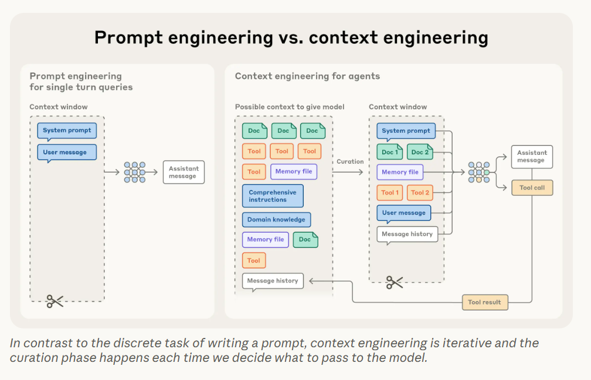
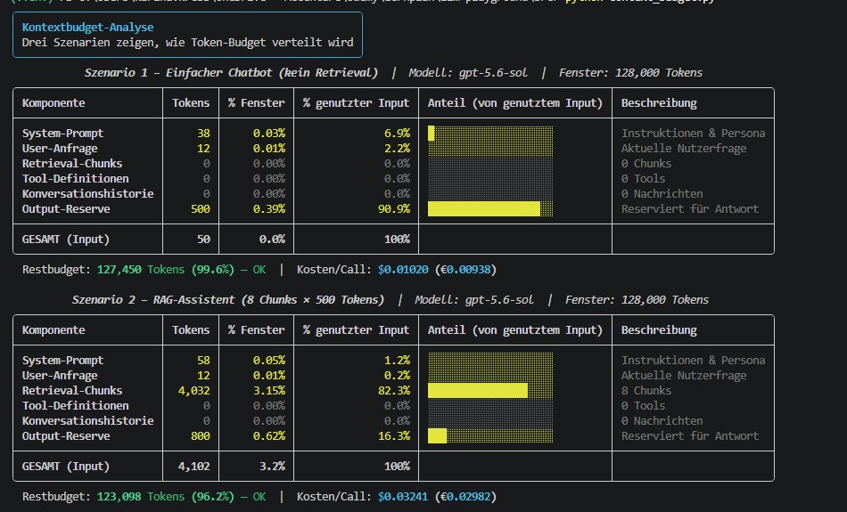
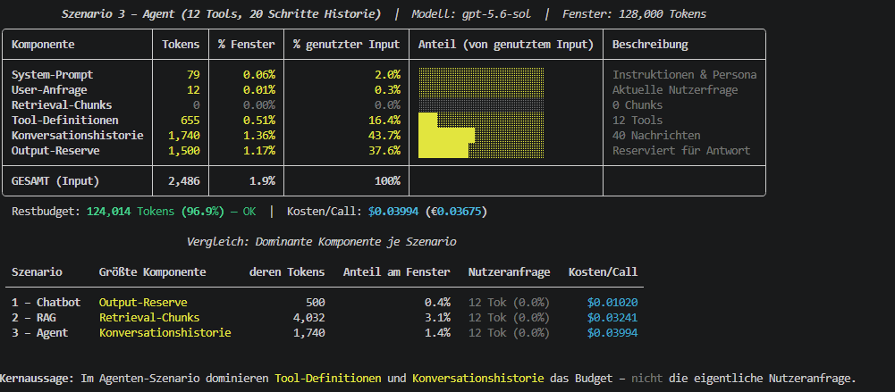

# Context Engineering

## What is context engineering?

Context engineering is the practice of carefully choosing what information to put into an LLM's context window — and when. The goal is to always give the model exactly the right information it needs, no more and no less, so it can perform well across longer, multi-step tasks.

## Why is this so important?

LLMs have a limited memory — they can only "see" and process a fixed amount of text at once. When the context gets too large, the model can lose focus or get confused. This creates a fundamental tension: more context means more information, but too much context means the model struggles to pay attention to what actually matters.

There are techniques (like position encoding interpolation) that let models handle longer inputs than they were originally trained on — but these come with trade-offs, like reduced accuracy in tracking where specific information appeared.

## The anatomy of effective context

The key principle is: find the smallest set of highly relevant information that gives the model the best chance of producing the right output.

**System Prompts**: A good system prompt is clear, direct, and written at the right level of detail — not too specific, not too vague. There are two common failure modes:
- Too specific: hardcoding rigid, complex logic that breaks when conditions change
- Too vague: giving the model only high-level instructions that leave too much room for interpretation

The sweet spot is a prompt that guides behavior reliably while still being flexible. Structure helps: break prompts into named sections like `<background_information>`, `<instructions>`, `## Tool guidance`, `## Output description`, etc. Aim for the minimum amount of information that fully describes what you expect the model to do.

**Tools**: Tools let an agent interact with its environment and pull in new information as it works. Think of tools as defining the contract between the agent and the outside world, what it can look up, what it can do.

Keep tool sets lean. Too many tools can overwhelm the agent with choices or create ambiguity. A minimal, well-chosen set of tools is easier to maintain and leads to more reliable behavior over long interactions. Providing worked examples (few-shot prompting) is strongly recommended — curate a diverse set of representative examples that show the model exactly how you want it to behave.

## Context retrieval and agentic search

LLMs can use tools autonomously in a loop, meaning they decide when and how to fetch information on their own. Currently, most systems use embedding-based retrieval: relevant data is pre-fetched before the model starts reasoning, so the important context is already present when the model needs it.

As agents become more capable, teams are shifting toward "just in time" retrieval. Instead of loading all potentially relevant data upfront, the system stores lightweight references (like IDs or pointers). The model then fetches only what it actually needs, when it needs it, for example by writing targeted search queries, storing intermediate results, or running Bash commands to pull in data dynamically.

This autonomous navigation enables **progressive disclosure**: each step surfaces context that informs the next decision, keeping the agent focused on a relevant subset rather than drowning in everything at once.

The trade-off: autonomous retrieval is slower than loading precomputed data upfront, and the agent needs clear guidance to avoid wasting time on unnecessary tool calls. In practice, most systems use a **hybrid approach** pre-fetching some data upfront and letting the agent retrieve additional context autonomously as needed. The right balance depends on the task. For example, domains with less dynamic content (like legal or finance) may benefit more from the predictability of pre-fetched data, while highly dynamic tasks benefit from just-in-time retrieval. Claude itself uses a hybrid model.

## Context retrieval for long-horizon tasks
**Compaction**: Taking a conversation nearing the context window limit, summarizing its contents and reinitiating a new context window with the summary. 

**Structured note-taking**: The agent writes regulary noted persisted to memory outside of the context window. These notes get pulled back into the context window at later times. -> Provied persistent memory with minimal overhead

**Sub-agent architectures**: Handle focused task with clean context windows. The main agent coordinates with a high level plan while subagents perform deep technical work or use tools to find relevant informations. -> Achieves a clear seperation of convern

The choice depends on task characteristics e.g.
- Compaction for task requiering extensive back and-forth;
- Note-taking for iterative development with clear milestones
- Sub-agent for complex research and analysis where parallel exploration pays dividends

# Kontrollfragen:

1. Der „Lost in the Middle"-Effekt
LLMs schenken Informationen am Anfang und Ende des Kontexts mehr Aufmerksamkeit als der Mitte. Was dort steht, wird schlechter erinnert und genutzt — es "versinkt" im Rauschen.

Folge für die Reihenfolge:
Lege die wichtigsten Informationen an die Ränder des Kontexts:

System-Prompt → ganz vorne
Aktuellste / relevanteste Retrieval-Chunks → ganz hinten, kurz vor der User-Anfrage
Ältere Historie oder weniger kritische Chunks → in die Mitte

2. Agent mit 80 % gefüllter Historie — zwei Strategien

Strategie 1 — Compaction (Zusammenfassen):
Wenn das Fenster voll wird, fasse die ältere Historie zu einer kompakten Zusammenfassung zusammen und starte ein neues Kontextfenster nur mit dieser Summary + den letzten N Schritten. Die Information bleibt erhalten, der Platzverbrauch schrumpft drastisch.

Strategie 2 — Strukturiertes Note-Taking:
Der Agent schreibt nach jedem Schritt eine kurze Notiz in einen externen Speicher (Datei, Datenbank). Die volle Gesprächshistorie wird gar nicht mitgeschleppt — stattdessen werden nur die relevanten Notizen bei Bedarf zurück in den Kontext geladen. Persistente Erinnerung bei minimalem Token-Verbrauch.

3. Wann ist ein 1-Mio-Token-Fenster schlechter als RAG?
Ein riesiges Fenster ist die schlechtere Wahl, wenn:

Die Daten dynamisch sind — ein 1-Mio-Fenster ist statisch befüllt. Wenn sich die Wissensbasis täglich ändert, muss RAG den Index aktualisieren; das Fenster müsstest du bei jedem Call neu befüllen.
Die Kosten zählen — du zahlst für jeden Token im Fenster, auch wenn das Modell 90 % davon ignoriert. RAG lädt nur die 5-10 wirklich relevanten Chunks → deutlich günstiger pro Call.
Der „Lost in the Middle"-Effekt zuschlägt — bei 1 Mio. Tokens ist die Wahrscheinlichkeit hoch, dass das Modell wichtige Infos in der Mitte schlicht übersieht. RAG liefert stattdessen gezielte, kompakte Treffer direkt an den Rand des Kontexts.
Kurz: Großes Fenster = bequem, aber teuer und unzuverlässig bei großen, wechselnden Wissensbasen. RAG = präziser, günstiger, besser skalierbar.